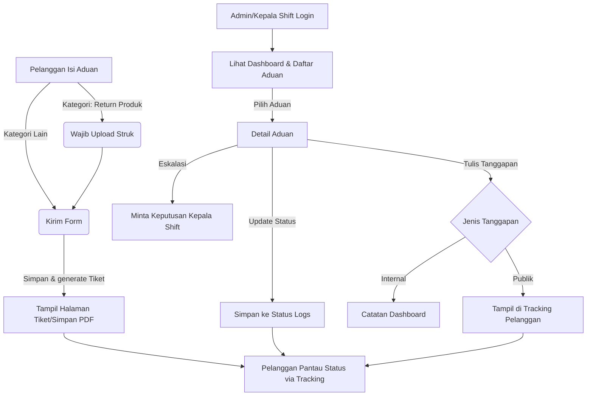

# Sipena MBC Swalayan - Laravel Version

Sipena MBC Swalayan adalah sistem pengaduan pelanggan berbasis website yang dikembangkan menggunakan **Laravel Framework (MVC)**. Sistem ini mempermudah pelanggan dalam menyampaikan keluhan secara daring, melakukan tracking status secara real-time, serta memberikan ruang kerja terstruktur bagi Karyawan (Admin) dan Kepala Shift (Super Admin) untuk memproses aduan.

---

## 💻 Kebutuhan Minimal Sistem (Minimum Resources)

* **PHP**: Versi `8.2` atau lebih baru (System saat ini berjalan pada PHP `8.5.2`).
* **Database**: `SQLite` (Default development) atau `MySQL` / `MariaDB` 8.0+.
* **Composer**: Versi `2.0` atau lebih baru.
* **Ekstensi PHP**: `pdo_sqlite`, `pdo_mysql`, `mbstring`, `openssl`, `xml`, `ctype`, `fileinfo`.
* **Browser**: Chrome, Firefox, Safari, Edge, atau browser modern lainnya.

---

## 🎯 Tentang Project (About Project)

Aplikasi ini merupakan migrasi dari versi **PHP Native** ke dalam ekosistem **Laravel** dengan arsitektur modern. Pemisahan logika data (Model), tampilan antarmuka (View - Blade), dan kontrol alur bisnis (Controller) membuat kode lebih aman, modular, dan mudah dipelihara. Seluruh layout didesain responsif dengan menggunakan sistem grid CSS khusus yang memberikan performa visual yang premium.

---

## ⚡ Fitur Utama & Keunggulan Sistem

1. **Formulir Pengaduan Dinamis**: 
   * Validasi cerdas (kondisional): Jika memilih kategori `Return Produk`, wajib mengunggah file Struk Belanja. Jika memilih kategori `Masalah Lain`, wajib mengisi deskripsi teks masalah khusus.
   * Mendukung upload file Struk dan Dokumen Pendukung (format JPG, PNG, PDF dengan batas ukuran maksimal 2 MB).
2. **Nomor Tiket & Token Unik Otomatis**: Generator tiket otomatis berbasis tanggal aduan (format: `SPN-YYYYMMDD-XXXX`) dan hash token unik untuk autentikasi akses langsung ke detail tiket.
3. **Pelacakan Aduan (Live Tracking)**: Pelanggan dapat memantau status aduan, melihat timeline proses, dan membaca tanggapan resmi petugas cukup dengan menginput Nomor Tiket dan Nomor WhatsApp yang terdaftar.
4. **Alur Kerja Eskalasi**: Karyawan (Admin) dapat meneruskan/eskalasi aduan yang rumit kepada Kepala Shift (Super Admin) dengan catatan internal khusus.
5. **Papan Kerja Karyawan & Kepala Shift**: 
   * Dashboard statistik aduan (`Diajukan`, `Diproses`, `Selesai`, `Total`).
   * Riwayat status yang tercatat di audit log (`status_logs`).
   * Kolom tanggapan internal (hanya dibaca oleh tim internal) dan tanggapan publik (tampil di halaman tracking pelanggan).
6. **Ekspor Laporan Fleksibel**: 
   * Download rekap laporan berdasarkan filter bulan, tahun, dan status aduan ke dalam format **Excel/CSV**, **Microsoft Word (.doc)**, dan layout **Cetak / Save as PDF** bawaan browser.
7. **Keamanan Maksimal**:
   * Proteksi bawaan dari serangan CSRF di seluruh form posting.
   * Proteksi password aman menggunakan algoritma hash `bcrypt`.
   * Penanganan sanitasi input dan tipe file menggunakan class `FileInfo` Laravel.
   * Tipe data Blade yang aman melalui deklarasi PHPDoc untuk mencegah error linter.

---

## 📁 Struktur Direktori (Blueprint File Tree)

Berikut adalah struktur file penting hasil migrasi di dalam folder [laravel](file:///Users/aaaa/Downloads/anin/laravel):

```text
laravel/
├── app/
│   ├── Http/
│   │   ├── Controllers/
│   │   │   ├── Admin/
│   │   │   │   ├── DashboardController.php   # Logika dashboard aduan & counter statistik
│   │   │   │   ├── ComplaintController.php   # Logika detail, update status, tanggapan & eskalasi
│   │   │   │   └── ReportController.php      # Formatting ekspor (CSV, Word, Print) aduan
│   │   │   ├── SuperAdmin/
│   │   │   │   ├── UserController.php        # CRUD manajemen akun admin & kepala shift
│   │   │   │   └── SettingController.php     # Pengaturan landing page (running text, dll)
│   │   │   ├── AuthController.php            # Logika login & logout tim admin
│   │   │   └── LandingPageController.php     # Logika pelanggan (index, submit, tracking, tiket)
│   │   └── Middleware/
│   │       └── RoleMiddleware.php            # Filter hak akses berdasarkan role akun
│   └── Models/
│       ├── User.php                          # Model Akun Admin & Kepala Shift
│       ├── Complaint.php                     # Model Aduan (lengkap dengan helper label & status class)
│       ├── ComplaintResponse.php             # Model Tanggapan (Internal/Publik) aduan
│       ├── StatusLog.php                     # Model Audit Log perubahan status aduan
│       └── LandingSetting.php                # Model Pengaturan landing page
├── bootstrap/
│   └── app.php                               # Registrasi middleware 'role' & exception JSON
├── config/                                   # Konfigurasi sistem (database, mail, session, dll)
├── database/
│   ├── migrations/                           # Skema DDL tabel database
│   └── seeders/
│       └── DatabaseSeeder.php                # Data awal untuk akun default dan config landing page
├── public/
│   ├── assets/
│   │   ├── css/
│   │   │   └── style.css                     # Stylesheet utama (desain premium grid layout)
│   │   └── js/
│   │       └── app.js                        # Script menu navigasi responsif
│   └── storage/ -> storage/app/public/       # Symlink untuk folder upload file
├── resources/
│   └── views/
│       ├── admin/                            # Blade view Dashboard & Login
│       ├── layouts/
│       │   └── app.blade.php                 # Core master layout (termasuk alert flash)
│       ├── public/                           # Blade view untuk halaman pelanggan
│       └── superadmin/                       # Blade view kelola user & pengaturan landing page
└── routes/
    └── web.php                               # Definisi seluruh rute aplikasi (36 routes)
```

---

## 🗄️ Arsitektur Database (Skema Relasi)

Database dirancang dengan integritas data referensial yang ketat (`CASCADE` pada penghapusan aduan dan `SET NULL` saat admin dinonaktifkan). Berikut adalah visualisasi skema relasi database:

```mermaid
erDiagram
    USERS {
        int id PK
        string nama
        string username UNIQUE
        string password
        enum role "admin, super_admin"
        boolean is_active
        datetime last_login
        datetime created_at
        datetime updated_at
    }

    COMPLAINTS {
        int id PK
        string ticket_no UNIQUE
        string public_token UNIQUE
        string nama_pelanggan
        string nomor_wa
        string nomor_wa_clean
        enum kategori "pelayanan, return_produk, produk, masalah_lain"
        string kategori_lain
        text keterangan
        string struk_file
        string dokumen_file
        enum status "diajukan, diproses, diteruskan, menunggu_keputusan, ditanggapi, selesai, ditolak"
        int assigned_admin_id FK
        int escalated_to_id FK
        datetime created_at
        datetime updated_at
        datetime closed_at
    }

    COMPLAINT_RESPONSES {
        int id PK
        int complaint_id FK
        int user_id FK
        enum sender_role "admin, super_admin, system"
        enum visibility "internal, public"
        text message
        string attachment_file
        datetime created_at
        datetime updated_at
    }

    STATUS_LOGS {
        int id PK
        int complaint_id FK
        string old_status
        string new_status
        int changed_by FK
        text note
        datetime created_at
        datetime updated_at
    }

    LANDING_SETTINGS {
        int id PK
        string setting_key UNIQUE
        text setting_value
        datetime created_at
        datetime updated_at
    }

    COMPLAINTS }o--|| USERS : "assigned_admin_id"
    COMPLAINTS }o--|| USERS : "escalated_to_id"
    COMPLAINT_RESPONSES }o--|| COMPLAINTS : "complaint_id"
    COMPLAINT_RESPONSES }o--|| USERS : "user_id"
    STATUS_LOGS }o--|| COMPLAINTS : "complaint_id"
    STATUS_LOGS }o--|| USERS : "changed_by"
```

---

## 🔄 Alur Kerja Sistem (System Workflow)



---

## ⚙️ Validasi & Logika Teknis Khusus

1. **Pembersihan Nomor WA (`nomor_wa_clean`)**:
   Seluruh karakter non-angka dieliminasi sebelum disimpan ke kolom `nomor_wa_clean` (regex: `preg_replace('/\D+/', '', $wa)`). Hal ini memastikan pencarian live-tracking tetap akurat meskipun pelanggan menulis format berbeda (misalnya: `0812-345-678` atau `+62812345678`).
2. **Kueri Tanggal Lintas Database (SQLite & MySQL)**:
   Untuk mempermudah debugging lokal menggunakan SQLite dan deployment produksi menggunakan MySQL, ReportController mengidentifikasi tipe database aktif secara dinamis. Pengecekan bulan dan tahun diformat menggunakan fungsi bawaan masing-masing:
   * **SQLite**: `strftime('%m', created_at)` dan `strftime('%Y', created_at)`.
   * **MySQL**: `whereMonth('created_at', $bulan)` dan `whereYear('created_at', $tahun)`.
3. **Word Export Layout Rendering**:
   Logika ekspor dokumen ke Word memanfaatkan format render HTML murni dengan header tipe dokumen Word:
   * `Content-Type: application/vnd.ms-word; charset=utf-8`
   * `Content-Disposition: attachment; filename="laporan_pengaduan_..."`
   Microsoft Word dapat membaca format tabel HTML ini secara langsung tanpa library berat.
4. **Excel/CSV BOM Header**:
   Untuk mencegah masalah encoding karakter non-ASCII (seperti huruf beraksen atau tanda baca tertentu) saat dibuka langsung di Microsoft Excel, kami menambahkan BOM UTF-8 pada awal file CSV (`fprintf($handle, chr(0xEF).chr(0xBB).chr(0xBF))`).

---

## 📦 Dependensi Project

Proyek ini dibangun menggunakan fitur-fitur native dari framework Laravel tanpa dependensi pihak ketiga yang berlebihan untuk memastikan kecepatan load dan efisiensi memori:
* **Laravel Framework 13.x**
* **Laravel Tinker 3.x**
* **Laravel Pint 1.x** (Untuk code formatting)

---

## 🛠️ Panduan Instalasi & Menjalankan Project (Setup & Run)

Ikuti langkah-langkah di bawah ini untuk menjalankan project ini di komputer lokal Anda:

1. **Buka Terminal** dan masuk ke direktori laravel:
   ```bash
   cd /Users/aaaa/Downloads/anin/laravel
   ```

2. **Instal Dependensi Composer**:
   ```bash
   composer install
   ```

3. **Salin File Environment**:
   ```bash
   cp .env.example .env
   ```

4. **Generate Application Key**:
   ```bash
   php artisan key:generate
   ```

5. **Buat file database SQLite** (jika menggunakan SQLite default):
   ```bash
   touch database/database.sqlite
   ```

6. **Jalankan Migrasi & Pengisian Data Awal (Seed)**:
   ```bash
   php artisan migrate:fresh --seed
   ```

7. **Hubungkan Folder Upload File (Storage Link)**:
   ```bash
   php artisan storage:link
   ```

8. **Jalankan Laravel Development Server**:
   ```bash
   php artisan serve --port=8000
   ```
   Aplikasi Anda sekarang dapat diakses melalui browser di alamat: `http://127.0.0.1:8000`

---

## 🔑 Kredensial Akun Bawaan (Default Credentials)

Gunakan akun berikut setelah berhasil menjalankan database seed:

* **Kepala Shift / Super Admin**:
  * **Username**: `superadmin`
  * **Password**: `Admin@12345`
* **Karyawan / Admin**:
  * **Username**: `admin`
  * **Password**: `Admin@12345`

*Segera ubah password Anda dari dashboard demi keamanan sistem.*
