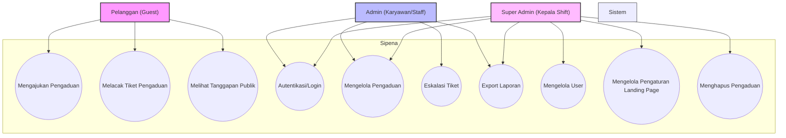
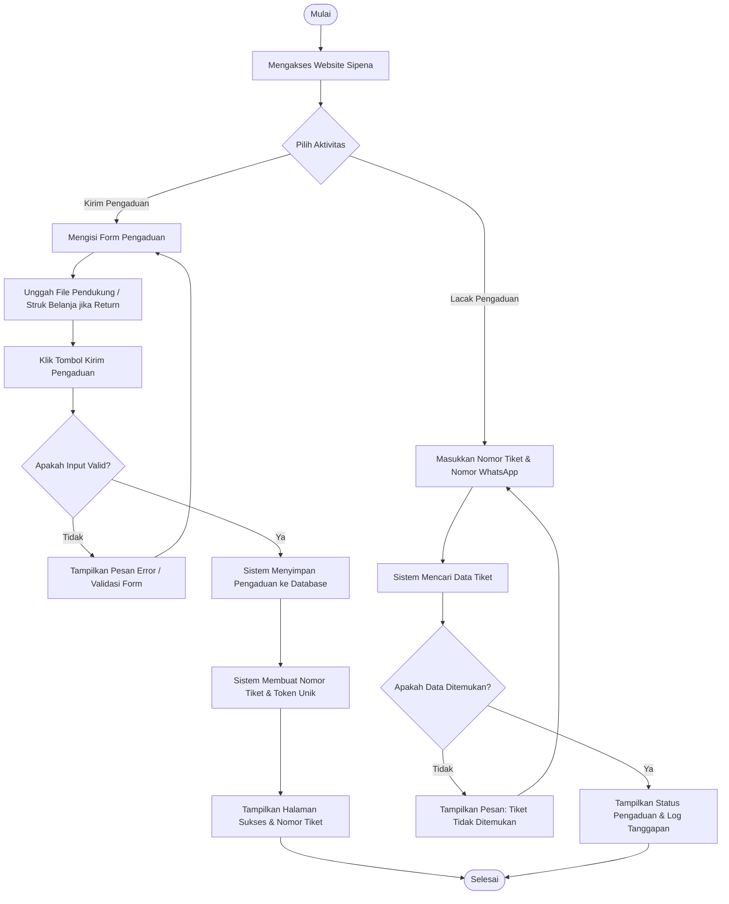
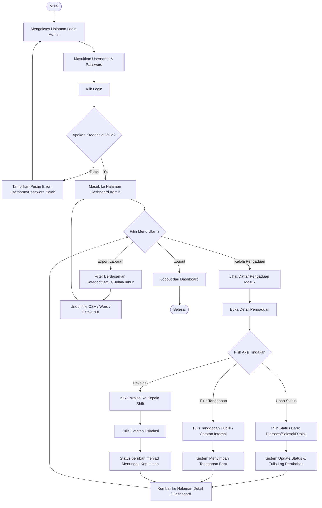
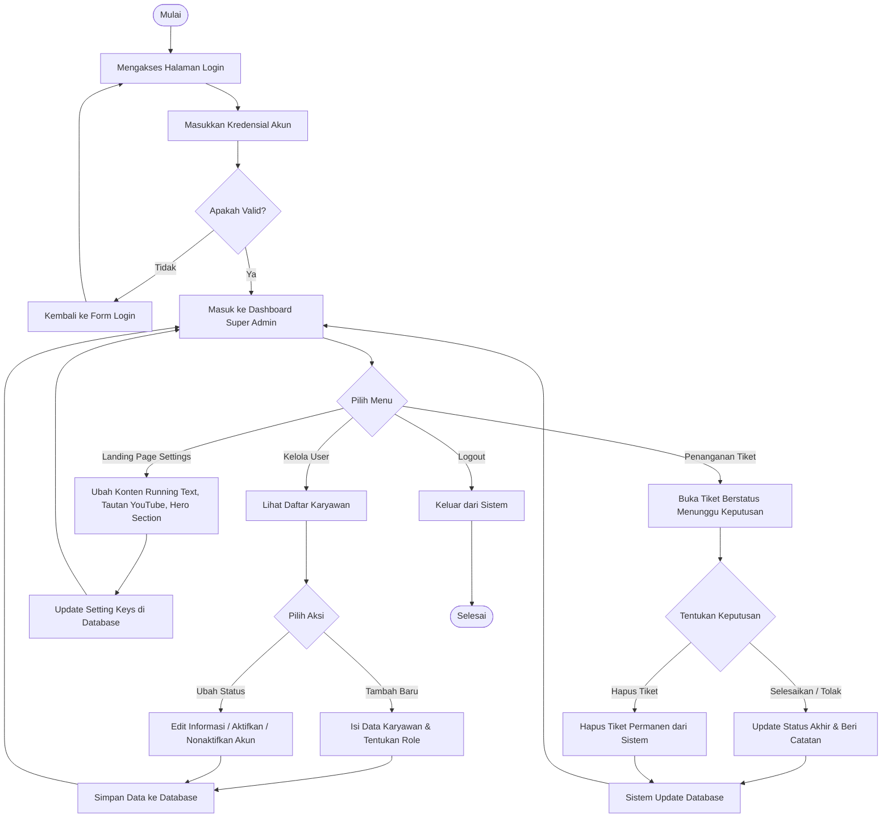

# Dokumentasi Sistem Pengaduan Pelanggan (Sipena) - Edisi Draw.io

Dokumen ini berisi rancangan sistem informasi pengaduan pelanggan berbasis web yang sama dengan [skripsi.md](file:///Users/aaaa/Downloads/anin/laravel/skripsi.md), namun bagian ERD (Entity Relationship Diagram) telah disesuaikan agar Anda dapat mengimpornya langsung ke **Draw.io** secara otomatis.

---

## 1. Use Case Diagram

Use Case Diagram menggambarkan interaksi antara aktor (pengguna sistem) dengan fungsionalitas yang disediakan oleh sistem informasi pengaduan pelanggan. 

### Diagram Use Case


### Penjelasan Use Case Diagram
Berdasarkan diagram di atas, terdapat 3 (tiga) aktor utama yang berinteraksi dengan sistem dengan deskripsi hak akses sebagai berikut:
1. **Pelanggan (Guest)**: 
   - **Mengajukan Pengaduan**: Pelanggan dapat mengisi formulir keluhan (nama, nomor WhatsApp, kategori masalah, keterangan, dan mengunggah dokumen/struk pendukung).
   - **Melacak Tiket Pengaduan**: Pelanggan dapat melihat perkembangan status pengaduannya secara real-time dengan memasukkan nomor tiket dan nomor WhatsApp yang valid.
   - **Melihat Tanggapan Publik**: Pelanggan dapat melihat respon atau balasan publik yang ditulis oleh Admin/Super Admin terkait tiket yang mereka ajukan.
2. **Admin (Karyawan/Staff)**:
   - **Autentikasi/Login**: Mengakses dashboard admin melalui proses verifikasi username dan password.
   - **Mengelola Pengaduan**: Memperbarui status keluhan (seperti mengubah status menjadi `diproses`, `ditanggapi`, `selesai`, atau `ditolak`) serta menambahkan tanggapan internal (catatan rahasia staff) maupun tanggapan publik.
   - **Eskalasi Tiket**: Meneruskan pengaduan yang memerlukan persetujuan khusus ke Kepala Shift (Super Admin).
   - **Export Laporan**: Mengunduh rekapitulasi data pengaduan dalam format CSV, dokumen Word, atau mencetaknya secara langsung (Print/PDF).
3. **Super Admin (Kepala Shift)**:
   - Memiliki semua hak akses yang dimiliki oleh Admin.
   - **Mengelola User**: Menambahkan user baru (Admin/Super Admin), mengedit informasi akun, serta menonaktifkan akun karyawan yang sudah tidak aktif.
   - **Mengelola Pengaturan Landing Page**: Mengubah konten dinamis pada halaman publik seperti Running Text, tautan video edukasi/YouTube, Judul/Deskripsi Hero section, serta informasi jam operasional layanan.
   - **Menghapus Pengaduan**: Memiliki wewenang eksklusif untuk menghapus tiket pengaduan tertentu dari sistem jika terjadi duplikasi atau kesalahan fatal.

---

## 2. Activity Diagram

Activity Diagram menggambarkan alur kerja (workflow) atau urutan aktivitas yang terjadi di dalam sistem dari sudut pandang masing-masing role.

### A. Activity Diagram: Pelanggan (Guest)


### B. Activity Diagram: Admin (Staff)


### C. Activity Diagram: Super Admin (Kepala Shift)


---

## 3. Entity Relationship Diagram (ERD) - Notasi Chen (Draw.io Ready)

Dalam penulisan skripsi akademik, ERD sering kali diwajibkan menggunakan **Notasi Chen** tradisional yang terdiri atas:
- **Persegi Panjang (Rectangles)** untuk merepresentasikan **Entitas**.
- **Bulat Lonjong / Elips (Ovals/Stadia)** untuk merepresentasikan **Atribut** (dengan garis bawah `<u>...</u>` untuk Primary Key).
- **Belah Ketupat / Diamond (Diamonds)** untuk merepresentasikan **Relasi/Hubungan** antarentitas beserta kardinalitasnya (1 ke N).

### Diagram ERD Notasi Chen
Berikut adalah visualisasi ERD Chen yang siap dirender secara langsung di Markdown dan dapat Anda impor langsung ke **Draw.io**:

```mermaid
flowchart TD
    %% Entities (Rectangles)
    U[users]
    C[complaints]
    CR[complaint_responses]
    SL[status_logs]
    LS[landing_settings]

    style U fill:#fff,stroke:#333,stroke-width:2px
    style C fill:#fff,stroke:#333,stroke-width:2px
    style CR fill:#fff,stroke:#333,stroke-width:2px
    style SL fill:#fff,stroke:#333,stroke-width:2px
    style LS fill:#fff,stroke:#333,stroke-width:2px

    %% Relationships (Diamonds)
    R_menangani{menangani}
    R_menerima{menerima}
    R_menulis{menulis}
    R_mengubah{mengubah}
    R_memiliki_resp{memiliki}
    R_memiliki_log{memiliki}

    style R_menangani fill:#fff,stroke:#333,stroke-width:2px
    style R_menerima fill:#fff,stroke:#333,stroke-width:2px
    style R_menulis fill:#fff,stroke:#333,stroke-width:2px
    style R_mengubah fill:#fff,stroke:#333,stroke-width:2px
    style R_memiliki_resp fill:#fff,stroke:#333,stroke-width:2px
    style R_memiliki_log fill:#fff,stroke:#333,stroke-width:2px

    %% Attributes for users (Ovals)
    u1(["<u>id</u>"])
    u2(["nama"])
    u3(["username"])
    u4(["password"])
    u5(["role"])
    u6(["is_active"])
    u7(["last_login"])

    U --- u1
    U --- u2
    U --- u3
    U --- u4
    U --- u5
    U --- u6
    U --- u7

    %% Attributes for complaints (Ovals)
    c1(["<u>id</u>"])
    c2(["ticket_no"])
    c3(["public_token"])
    c4(["nama_pelanggan"])
    c5(["nomor_wa"])
    c6(["kategori"])
    c7(["kategori_lain"])
    c8(["keterangan"])
    c9(["struk_file"])
    c10(["dokumen_file"])
    c11(["status"])
    c12(["closed_at"])

    C --- c1
    C --- c2
    C --- c3
    C --- c4
    C --- c5
    C --- c6
    C --- c7
    C --- c8
    C --- c9
    C --- c10
    C --- c11
    C --- c12

    %% Attributes for complaint_responses (Ovals)
    cr1(["<u>id</u>"])
    cr2(["sender_role"])
    cr3(["visibility"])
    cr4(["message"])
    cr5(["attachment_file"])

    CR --- cr1
    CR --- cr2
    CR --- cr3
    CR --- cr4
    CR --- cr5

    %% Attributes for status_logs (Ovals)
    sl1(["<u>id</u>"])
    sl2(["old_status"])
    sl3(["new_status"])
    sl4(["note"])

    SL --- sl1
    SL --- sl2
    SL --- sl3
    SL --- sl4

    %% Attributes for landing_settings (Ovals)
    ls1(["<u>id</u>"])
    ls2(["setting_key"])
    ls3(["setting_value"])

    LS --- ls1
    LS --- ls2
    LS --- ls3

    %% Connections with cardinalities (Users & Complaints)
    U -- "1" --- R_menangani
    R_menangani --- "N" --> C
    
    U -- "1" --- R_menerima
    R_menerima --- "N" --> C
    
    %% Users & Responses
    U -- "1" --- R_menulis
    R_menulis --- "N" --> CR
    
    %% Users & Logs
    U -- "1" --- R_mengubah
    R_mengubah --- "N" --> SL
    
    %% Complaints & Responses
    C -- "1" --- R_memiliki_resp
    R_memiliki_resp --- "N" --> CR
    
    %% Complaints & Logs
    C -- "1" --- R_memiliki_log
    R_memiliki_log --- "N" --> SL
```

### Panduan Impor Langsung ke Draw.io
Untuk memasukkan diagram Notasi Chen di atas ke Draw.io secara instan:
1. Buka halaman pembuatan diagram baru di [Draw.io](https://app.diagrams.net/).
2. Pada menu atas, klik **Arrange** > **Insert** > **Advanced** > **Mermaid...** (atau klik ikon **`+`** di toolbar > **Advanced** > **Mermaid...**).
3. Hapus teks contoh bawaan Draw.io.
4. Salin seluruh kode blok di atas (mulai dari kata `flowchart TD` sampai akhir) lalu tempel ke dalam kotak input Mermaid.
5. Klik tombol **Insert**. 
6. Draw.io akan otomatis menggambar seluruh entitas (persegi panjang), atribut (bulat lonjong/stadion), relasi (belah ketupat), beserta garis hubungan dan teks kardinalitasnya ke lembar kerja Anda. Anda dapat menggeser posisi shape sesuai selera estetika Anda.

---

## 4. Struktur Tabel Database

Berikut adalah spesifikasi teknis dari masing-masing tabel database yang digunakan oleh sistem berdasarkan migration database Laravel:

### A. Tabel `users`
Tabel ini digunakan untuk menyimpan data akun pengguna sistem (Admin dan Super Admin).

| Nama Kolom | Tipe Data | Atribut | Deskripsi |
| :--- | :--- | :--- | :--- |
| `id` | bigint | Primary Key, Auto Increment | ID unik pengguna |
| `nama` | string(255) | Not Null | Nama lengkap pengguna |
| `username` | string(255) | Unique, Not Null | Nama pengguna untuk login |
| `password` | string(255) | Not Null | Kata sandi yang telah di-hash (Bcrypt) |
| `role` | enum('admin', 'super_admin') | Not Null, Default: 'admin' | Hak akses level pengguna |
| `is_active` | boolean | Default: true | Status keaktifan akun pengguna |
| `last_login` | datetime | Nullable | Catatan waktu login terakhir |
| `created_at` | timestamp | Nullable | Waktu pembuatan baris data |
| `updated_at` | timestamp | Nullable | Waktu perubahan terakhir data |

### B. Tabel `complaints`
Tabel ini menyimpan seluruh informasi data pengaduan/keluhan yang diajukan oleh pelanggan.

| Nama Kolom | Tipe Data | Atribut | Deskripsi |
| :--- | :--- | :--- | :--- |
| `id` | bigint | Primary Key, Auto Increment | ID unik pengaduan |
| `ticket_no` | string(30) | Unique, Index, Not Null | Nomor tiket keluhan (Format: SPN-YYYYMMDD-XXXX) |
| `public_token` | string(100) | Unique, Not Null | Token rahasia untuk melacak pengaduan publik |
| `nama_pelanggan`| string(100) | Not Null | Nama lengkap pelapor |
| `nomor_wa` | string(30) | Not Null | Nomor WhatsApp pelapor |
| `nomor_wa_clean`| string(30) | Index, Not Null | Nomor WhatsApp pelapor (hanya angka) untuk optimasi pencarian |
| `kategori` | enum(...) | Index, Not Null | Kategori keluhan: 'pelayanan', 'return_produk', 'produk', 'masalah_lain' |
| `kategori_lain` | string(150) | Nullable | Spesifikasi keluhan jika memilih kategori 'masalah_lain' |
| `keterangan` | text | Nullable | Uraian lengkap mengenai kronologi keluhan |
| `struk_file` | string(255) | Nullable | Path lokasi file unggah struk belanja (wajib untuk return_produk) |
| `dokumen_file` | string(255) | Nullable | Path lokasi file unggah dokumen bukti pendukung lainnya |
| `status` | enum(...) | Index, Not Null, Default: 'diajukan' | Status pengaduan: 'diajukan', 'diproses', 'diteruskan', 'menunggu_keputusan', 'ditanggapi', 'selesai', 'ditolak' |
| `assigned_admin_id` | bigint | Foreign Key (users), Nullable | ID Admin yang ditugaskan menangani pengaduan |
| `escalated_to_id` | bigint | Foreign Key (users), Nullable | ID Super Admin tempat tiket ini dieskalasikan |
| `created_at` | timestamp | Index, Nullable | Tanggal pengaduan diajukan oleh pelanggan |
| `updated_at` | timestamp | Nullable | Tanggal perubahan data pengaduan |
| `closed_at` | datetime | Nullable | Tanggal keluhan dinyatakan selesai/ditutup |

### C. Tabel `complaint_responses`
Tabel ini digunakan untuk menyimpan seluruh riwayat percakapan/tanggapan dari keluhan yang terdaftar.

| Nama Kolom | Tipe Data | Atribut | Deskripsi |
| :--- | :--- | :--- | :--- |
| `id` | bigint | Primary Key, Auto Increment | ID unik tanggapan |
| `complaint_id` | bigint | Foreign Key (complaints), Not Null | ID pengaduan yang ditanggapi |
| `user_id` | bigint | Foreign Key (users), Nullable | ID pengguna (staff) yang membalas |
| `sender_role` | enum('admin','super_admin','system') | Default: 'admin' | Peran dari pengirim tanggapan |
| `visibility` | enum('internal','public') | Index, Default: 'internal' | Visibilitas tanggapan: 'internal' (rahasia staff) atau 'public' (bisa dilihat pelanggan) |
| `message` | text | Not Null | Isi teks tanggapan |
| `attachment_file` | string(255) | Nullable | Path lokasi file dokumen lampiran pendukung tanggapan |
| `created_at` | timestamp | Index, Nullable | Tanggal tanggapan dikirimkan |
| `updated_at` | timestamp | Nullable | Tanggal perubahan tanggapan |

### D. Tabel `status_logs`
Tabel ini digunakan untuk mencatat riwayat perubahan status tiket pengaduan secara transparan.

| Nama Kolom | Tipe Data | Atribut | Deskripsi |
| :--- | :--- | :--- | :--- |
| `id` | bigint | Primary Key, Auto Increment | ID unik log status |
| `complaint_id` | bigint | Foreign Key (complaints), Not Null | ID pengaduan yang mengalami perubahan status |
| `old_status` | string(50) | Nullable | Status sebelum diubah (kosong pada pembuatan awal) |
| `new_status` | string(50) | Not Null | Status baru setelah diubah |
| `changed_by` | bigint | Foreign Key (users), Nullable | ID pengguna (staff) yang melakukan perubahan status |
| `note` | text | Nullable | Alasan atau catatan tambahan terkait perubahan status |
| `created_at` | timestamp | Index, Nullable | Tanggal log status dicatat |
| `updated_at` | timestamp | Nullable | Tanggal log status diperbarui |

### E. Tabel `landing_settings`
Tabel ini menampung data konfigurasi antarmuka landing page dinamis yang dikelola oleh Super Admin.

| Nama Kolom | Tipe Data | Atribut | Deskripsi |
| :--- | :--- | :--- | :--- |
| `id` | bigint | Primary Key, Auto Increment | ID unik pengaturan |
| `setting_key` | string(100) | Unique, Not Null | Kata kunci pengaturan (contoh: `running_text`, `youtube_url`) |
| `setting_value`| text | Nullable | Nilai teks atau konten dari pengaturan |
| `created_at` | timestamp | Nullable | Tanggal konfigurasi dibuat |
| `updated_at` | timestamp | Nullable | Tanggal konfigurasi diperbarui |

---

## 5. Relasi Database dan Penjelasannya

Relasi antartabel di dalam database Sipena dibangun dengan merujuk pada integritas data referensial (referential integrity) sebagai berikut:

### A. Relasi Antara Tabel `users` dengan `complaints`
Hubungan antara tabel `users` dengan tabel `complaints` terbagi menjadi dua jalur relasi kunci asing (Foreign Key):
1. **Relasi Penugasan (`assigned_admin_id` -> `users.id`)**:
   - Satu pengguna (`users`) dengan peran Admin atau Super Admin dapat ditugaskan untuk menangani banyak tiket pengaduan pelanggan (**One-to-Many**). Setiap pengaduan (`complaints`) hanya ditangani oleh maksimal satu admin pada satu waktu.
   - *Kalimat Representasi*: "Satu admin dapat memproses nol hingga banyak pengaduan pelanggan, sedangkan setiap pengaduan pelanggan hanya dapat dialokasikan penanganannya kepada maksimal satu admin."
2. **Relasi Eskalasi (`escalated_to_id` -> `users.id`)**:
   - Satu pengguna dengan tingkat otoritas Kepala Shift/Super Admin dapat menerima eskalasi dari banyak pengaduan (**One-to-Many**). Sebaliknya, setiap pengaduan hanya dapat diteruskan ke satu Super Admin tertentu.
   - *Kalimat Representasi*: "Satu Kepala Shift dapat ditunjuk untuk menerima eskalasi keputusan dari nol hingga banyak keluhan pelanggan, sedangkan satu keluhan pelanggan hanya dapat dieskalasikan statusnya kepada maksimal satu Kepala Shift."

### B. Relasi Antara Tabel `complaints` dengan `complaint_responses`
Hubungan antara tabel `complaints` dengan tabel `complaint_responses` mengikat setiap tanggapan ke pengaduan induknya.
- **Relasi Kepemilikan Tanggapan (`complaint_responses.complaint_id` -> `complaints.id`)**:
   - Satu pengaduan dapat memuat banyak tanggapan atau respons, baik berupa diskusi internal sesama staff maupun balasan resmi kepada pelanggan (**One-to-Many**). Setiap baris tanggapan wajib merujuk secara eksklusif pada satu nomor pengaduan saja. Jika data induk pengaduan dihapus (`ON DELETE CASCADE`), maka seluruh riwayat tanggapan yang terikat juga akan terhapus secara otomatis.
   - *Kalimat Representasi*: "Satu tiket pengaduan pelanggan dapat memiliki banyak tanggapan pesan, sedangkan setiap pesan tanggapan hanya dapat merujuk ke satu tiket pengaduan yang bersangkutan."

### C. Relasi Antara Tabel `users` dengan `complaint_responses`
Hubungan ini mencatat siapa pembuat dari masing-masing tanggapan.
- **Relasi Penulis Tanggapan (`complaint_responses.user_id` -> `users.id`)**:
   - Satu pengguna (`users`) dapat menulis banyak pesan tanggapan di berbagai tiket pengaduan (**One-to-Many**). Sebaliknya, setiap pesan tanggapan ditulis oleh satu user terdaftar (atau bernilai null jika tanggapan dibuat otomatis oleh sistem).
   - *Kalimat Representasi*: "Satu user sistem dapat menulis nol hingga banyak pesan tanggapan pengaduan, sedangkan setiap pesan tanggapan hanya dapat diidentifikasi kepemilikan penulisnya oleh satu user sistem saja."

### D. Relasi Antara Tabel `complaints` dengan `status_logs`
Hubungan ini mencatat linimasa perubahan status yang dialami oleh suatu tiket pengaduan.
- **Relasi Log Perubahan Status (`status_logs.complaint_id` -> `complaints.id`)**:
   - Satu pengaduan dapat melalui beberapa tahapan siklus status (contoh dari `diajukan` -> `diproses` -> `ditanggapi` -> `selesai`) sehingga menghasilkan banyak catatan status log (**One-to-Many**). Setiap baris log status wajib terikat secara eksklusif ke satu pengaduan. Hubungan ini menggunakan aturan penghapusan berjenjang (`ON DELETE CASCADE`) untuk mempermudah kebersihan data.
   - *Kalimat Representasi*: "Satu pengaduan dapat menghasilkan banyak log riwayat perubahan status seiring berjalannya proses penanganan, sedangkan setiap log riwayat status hanya mendokumentasikan perubahan pada satu pengaduan saja."

### E. Relasi Antara Tabel `users` dengan `status_logs`
Hubungan ini mencatat pertanggungjawaban aktor yang mengubah status tiket.
- **Relasi Aktor Pengubah Status (`status_logs.changed_by` -> `users.id`)**:
   - Satu user (`users`) dapat melakukan pengubahan status pada berbagai keluhan pelanggan sebanyak beberapa kali (**One-to-Many**). Setiap log status mencatat satu user ID penanggung jawab tindakan tersebut.
   - *Kalimat Representasi*: "Satu admin dapat memicu pencatatan nol hingga banyak log perubahan status akibat tindakannya memperbarui tiket pengaduan, sedangkan setiap baris log perubahan status hanya mencatat satu admin yang melakukan tindakan perubahan tersebut."
