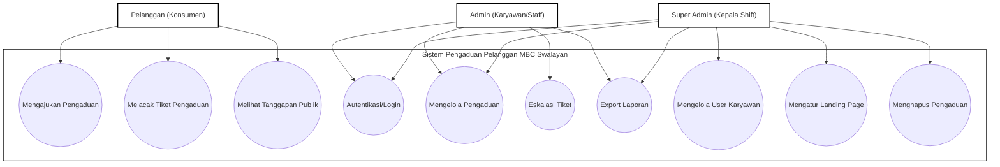
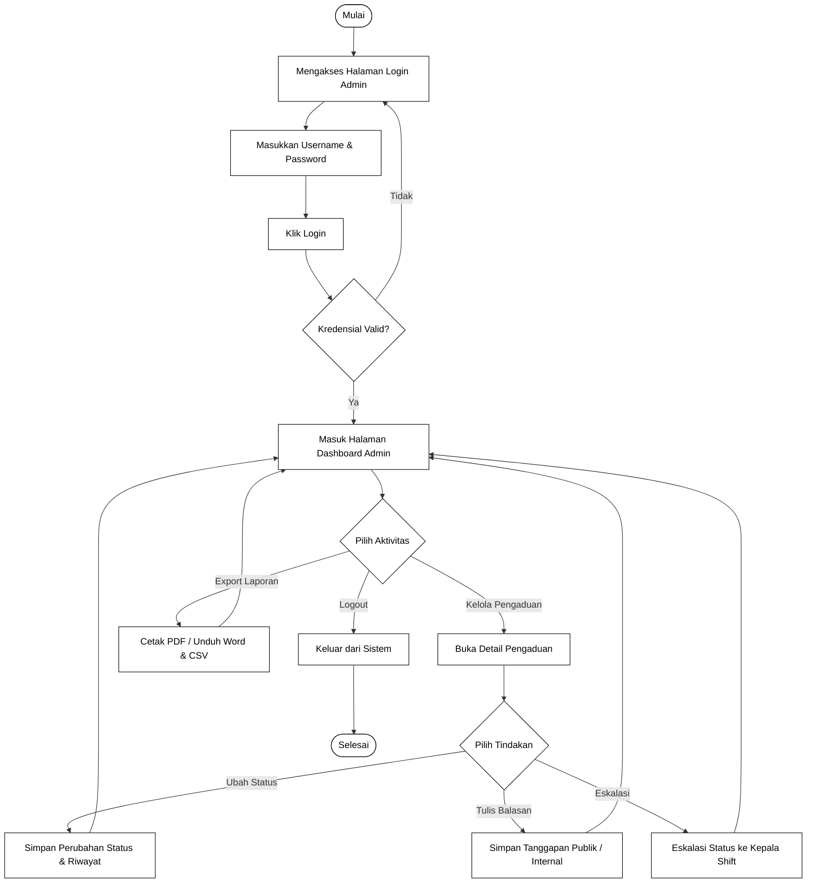
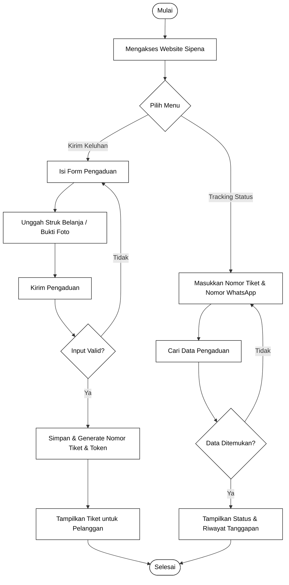
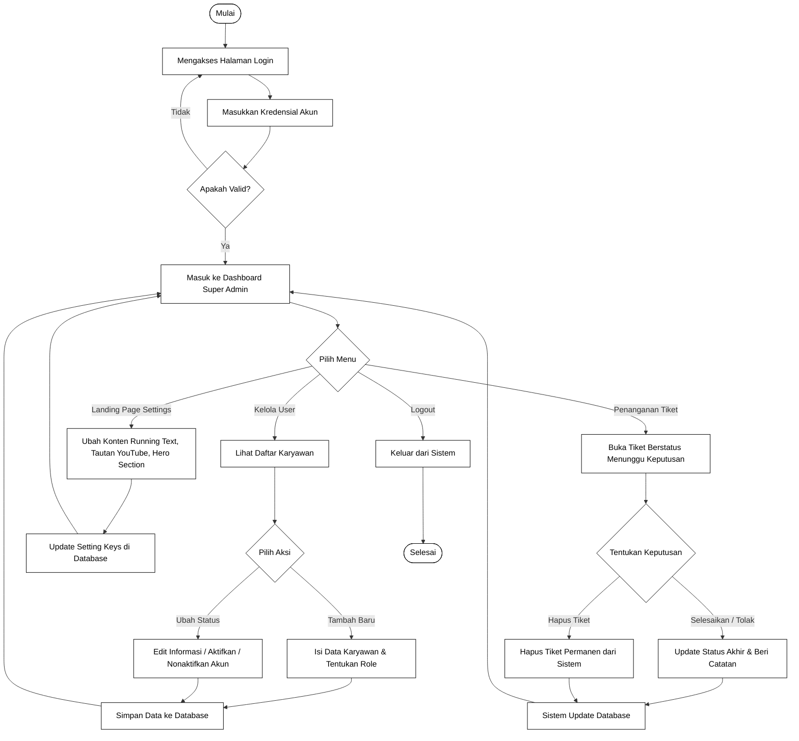
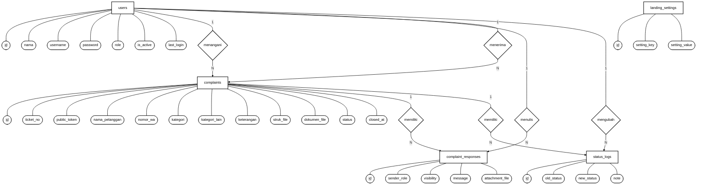
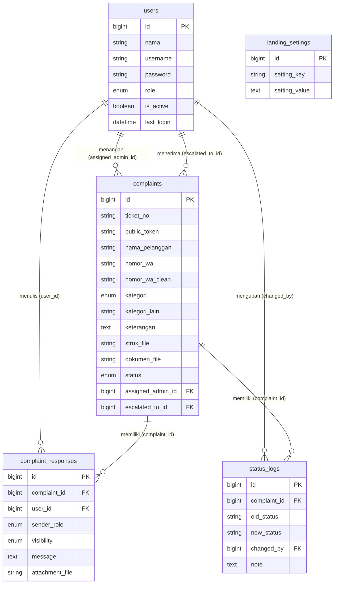
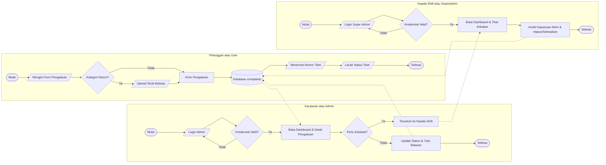

# Dokumentasi Perancangan Sistem Pengaduan Pelanggan Sipena MBC Swalayan

Berikut adalah perancangan sistem yang diusulkan oleh penulis sebagai acuan sebelum proses pembuatan kode program dilakukan.

---

## 2. Desain Sistem
Pada tahap ini, penulis menerjemahkan sistem yang dapat menentukan proses dan data yang diperlukan pada sistem pengaduan yang sudah dirancang sebelum pembuatan koding.

### 1) Use Case Diagram
Use Case Diagram menggambarkan fungsionalitas sistem dari sudut pandang interaksi antara pengguna atau aktor dengan sistem pengaduan pelanggan yang dinamakan Sipena pada MBC Swalayan. Diagram use case tersebut adalah sebagai berikut:



*Gambar 2.1. Use Case Diagram Sistem Informasi Pengaduan Pelanggan Sipena Pada MBC Swalayan.*

---

### 2) Activity Diagram
Activity diagram menunjukkan aliran kerja dari use case diagram untuk masing-masing role pengguna.

#### (1) Activity Diagram Admin
Pada Gambar 2.2 berikut merupakan activity diagram admin dalam mengelola data pada sistem informasi pengaduan pelanggan MBC Swalayan mulai dari proses autentikasi login hingga melakukan aksi pengelolaan.


*Gambar 2.2. Activity Diagram Admin Sistem Informasi Pengaduan Pelanggan Sipena.*

---

#### (2) Activity Diagram Konsumen atau Pelanggan
Pada Gambar 2.3 berikut merupakan activity diagram pada konsumen dalam menerima informasi, melacak status pengaduan, dan mengirimkan keluhan pada sistem informasi pengaduan pelanggan MBC Swalayan.


*Gambar 2.3. Activity Diagram Konsumen Sistem Informasi Pengaduan Pelanggan Sipena.*

---

#### (3) Activity Diagram Super Admin
Pada Gambar 2.4 berikut merupakan activity diagram Super Admin dalam melakukan pengelolaan data karyawan, konfigurasi landing page, serta menangani keluhan tingkat lanjut yang membutuhkan eskalasi di dalam sistem pengaduan pelanggan.


*Gambar 2.4. Activity Diagram Super Admin Sistem Informasi Pengaduan Pelanggan Sipena.*

---

## 3. Desain Prosedur Sistem Yang Diusulkan
Proses desain akan menerjemahkan sebuah perancangan perangkat lunak yang di mana sebelumnya diperkirakan untuk diimplementasikan ke koding. Berikut adalah langkah untuk melakukan desain sistem: desain database dan desain interface.

### a. Desain Database
Desain database terbagi menjadi dua bagian, yaitu Entity Relationship Diagram sistem informasi pengaduan pelanggan pada MBC Swalayan serta tabel.

#### 1. Entity Relationship Diagram sistem informasi pengaduan pelanggan pada MBC Swalayan
Berdasarkan Gambar 3.1, Entity Relationship Diagram sistem informasi pengaduan pelanggan pada MBC Swalayan terbagi menjadi lima tabel, yaitu tabel users, complaints, complaint_responses, status_logs, serta landing_settings, di mana setiap entitas memiliki beberapa atribut.


*Gambar 3.1. Entity Relationship Diagram ERD Sipena MBC Swalayan.*

---

#### 2) Tabel
Tabel database atau basis data adalah kumpulan file yang berkaitan dengan program, yang di mana untuk menyimpan data sistem informasi pengaduan pelanggan pada MBC Swalayan dibutuhkan database. Berikut ini adalah tabel – tabel yang berada dalam database:

##### (1) Tabel `users`
Tabel `users` diperlukan untuk mendaftarkan akun administrator sistem dan berfungsi untuk memproses otentikasi login serta identifikasi hak akses level pengguna, baik Admin maupun Super Admin.

Nama Tabel	: users
Attribute   	: id, nama, username, password, role, is_active, last_login, created_at, updated_at
Primary key 	: id
Jumlah field	: 9

| Field | Type | Null | Key | Default | Extra |
| :--- | :--- | :--- | :--- | :--- | :--- |
| `id` | bigint unsigned | NO | PRI | NULL | auto_increment |
| `nama` | varchar(255) | NO | | NULL | |
| `username` | varchar(255) | NO | UNI | NULL | |
| `password` | varchar(255) | NO | | NULL | |
| `role` | enum('admin','super_admin') | NO | | 'admin' | |
| `is_active` | tinyint(1) | NO | | 1 | |
| `last_login` | datetime | YES | | NULL | |
| `created_at` | timestamp | YES | | NULL | |
| `updated_at` | timestamp | YES | | NULL | |

Tabel 9. Rancangan basis data tabel login

##### (2) Tabel `complaints`
Tabel `complaints` diperlukan untuk merekam seluruh rincian keluhan masuk yang diajukan oleh konsumen.

Nama Tabel	: complaints
Attribute   	: id, ticket_no, public_token, nama_pelanggan, nomor_wa, nomor_wa_clean, kategori, kategori_lain, keterangan, struk_file, dokumen_file, status, assigned_admin_id, escalated_to_id, created_at, updated_at, closed_at
Primary key 	: id
Jumlah field	: 17

| Field | Type | Null | Key | Default | Extra |
| :--- | :--- | :--- | :--- | :--- | :--- |
| `id` | bigint unsigned | NO | PRI | NULL | auto_increment |
| `ticket_no` | varchar(30) | NO | UNI | NULL | |
| `public_token` | varchar(100) | NO | UNI | NULL | |
| `nama_pelanggan` | varchar(100) | NO | | NULL | |
| `nomor_wa` | varchar(30) | NO | | NULL | |
| `nomor_wa_clean` | varchar(30) | NO | | NULL | |
| `kategori` | enum('pelayanan','return_produk','produk','masalah_lain') | NO | | NULL | |
| `kategori_lain` | varchar(150) | YES | | NULL | |
| `keterangan` | text | YES | | NULL | |
| `struk_file` | varchar(255) | YES | | NULL | |
| `dokumen_file` | varchar(255) | YES | | NULL | |
| `status` | enum('diajukan','diproses','diteruskan','menunggu_keputusan','ditanggapi','selesai','ditolak') | NO | | 'diajukan' | |
| `assigned_admin_id` | bigint unsigned | YES | MUL | NULL | |
| `escalated_to_id` | bigint unsigned | YES | MUL | NULL | |
| `created_at` | timestamp | YES | | NULL | |
| `updated_at` | timestamp | YES | | NULL | |
| `closed_at` | datetime | YES | | NULL | |

Tabel 10. Rancangan basis data tabel pengaduan

##### (3) Tabel `complaint_responses`
Tabel `complaint_responses` diperlukan untuk mendata percakapan dan respon balasan dari staff admin maupun sistem.

Nama Tabel	: complaint_responses
Attribute   	: id, complaint_id, user_id, sender_role, visibility, message, attachment_file, created_at, updated_at
Primary key 	: id
Jumlah field	: 9

| Field | Type | Null | Key | Default | Extra |
| :--- | :--- | :--- | :--- | :--- | :--- |
| `id` | bigint unsigned | NO | PRI | NULL | auto_increment |
| `complaint_id` | bigint unsigned | NO | MUL | NULL | |
| `user_id` | bigint unsigned | YES | MUL | NULL | |
| `sender_role` | enum('admin','super_admin','system') | NO | | 'admin' | |
| `visibility` | enum('internal','public') | NO | | 'internal' | |
| `message` | text | NO | | NULL | |
| `attachment_file` | varchar(255) | YES | | NULL | |
| `created_at` | timestamp | YES | | NULL | |
| `updated_at` | timestamp | YES | | NULL | |

Tabel 11. Rancangan basis data tabel tanggapan pengaduan

##### (4) Tabel `status_logs`
Tabel `status_logs` diperlukan untuk mencatat riwayat perubahan status pelaporan keluhan secara berurutan.

Nama Tabel	: status_logs
Attribute   	: id, complaint_id, old_status, new_status, changed_by, note, created_at, updated_at
Primary key 	: id
Jumlah field	: 8

| Field | Type | Null | Key | Default | Extra |
| :--- | :--- | :--- | :--- | :--- | :--- |
| `id` | bigint unsigned | NO | PRI | NULL | auto_increment |
| `complaint_id` | bigint unsigned | NO | MUL | NULL | |
| `old_status` | varchar(50) | YES | | NULL | |
| `new_status` | varchar(50) | NO | | NULL | |
| `changed_by` | bigint unsigned | YES | MUL | NULL | |
| `note` | text | YES | | NULL | |
| `created_at` | timestamp | YES | | NULL | |
| `updated_at` | timestamp | YES | | NULL | |

Tabel 12. Rancangan basis data tabel log status

##### (5) Tabel `landing_settings`
Tabel `landing_settings` diperlukan untuk menampung pengaturan data antarmuka halaman beranda secara dinamis.

Nama Tabel	: landing_settings
Attribute   	: id, setting_key, setting_value, created_at, updated_at
Primary key 	: id
Jumlah field	: 5

| Field | Type | Null | Key | Default | Extra |
| :--- | :--- | :--- | :--- | :--- | :--- |
| `id` | bigint unsigned | NO | PRI | NULL | auto_increment |
| `setting_key` | varchar(100) | NO | UNI | NULL | |
| `setting_value` | text | YES | | NULL | |
| `created_at` | timestamp | YES | | NULL | |
| `updated_at` | timestamp | YES | | NULL | |

Tabel 13. Rancangan basis data tabel pengaturan landing page

---

#### 3) Relasi Tabel
Berdasarkan Gambar 3.2 relasi tabel ini memiliki 5 tabel, yaitu tabel `users`, `complaints`, `complaint_responses`, `status_logs`, dan `landing_settings`. Berikut relasi tabel:


*Gambar 3.2. Relasi Tabel Database Sipena MBC Swalayan.*

---

### b. Desain Interface
Rancangan antarmuka atau desain interface menerjemahkan kebutuhan fungsional sistem ke dalam rancangan grafis halaman publik maupun halaman administrator. Berikut adalah rancangan antarmuka yang ada pada sistem informasi pengaduan pelanggan Sipena pada MBC Swalayan:

#### 1) Rancangan Form Login Admin
Tampilan form login digunakan untuk memberikan hak akses kepada administrator, yaitu Admin atau Super Admin, untuk masuk ke halaman dashboard internal sistem. Form tersebut dirancang sebagai berikut:

##### Halaman Form Login Admin
```
+-------------------------------------------------------------------+
|                            LOGIN ADMIN                            |
+-------------------------------------------------------------------+
|                                                                   |
|   Username : [_________________________________________________]  |
|                                                                   |
|   Password : [_________________________________________________]  |
|                                                                   |
|                       [ MASUK ]                                   |
|                                                                   |
+-------------------------------------------------------------------+
```
*Gambar 3.3. Rancangan Form Login Admin.*

##### Tabel 14. Rancangan Tombol Form Login Admin
| No | Tombol | Fungsi |
| :--- | :--- | :--- |
| 1 | `MASUK` | Berfungsi untuk mengirimkan kredensial berupa username dan password ke sistem untuk divalidasi. Jika sukses, admin dialihkan ke halaman dashboard. |

---

#### 2) Rancangan Form Pengaduan Publik
Tampilan halaman pengaduan adalah halaman formulir utama publik ketika konsumen mengakses website untuk menulis keluhan mereka. Rancangan halaman tersebut adalah sebagai berikut:

##### Halaman Form Pengaduan Publik
```
+-------------------------------------------------------------------+
|                   FORMULIR PENGADUAN PELANGGAN                    |
+-------------------------------------------------------------------+
|                                                                   |
|  Nama Pelanggan : [____________________________________________]  |
|                                                                   |
|  Nomor WhatsApp : [____________________________________________]  |
|                                                                   |
|  Kategori       : [ Pelayanan / Produk / Return / Masalah Lain v] |
|                                                                   |
|  Struk Belanja  : [ Pilih File ] Wajib jika kategori return       |
|                                                                   |
|  Dokumen Bukti  : [ Pilih File ] Opsional                         |
|                                                                   |
|  Keterangan     :                                                 |
|  +-------------------------------------------------------------+  |
|  | Tulis isi keluhan Anda di sini...                           |  |
|  +-------------------------------------------------------------+  |
|                                                                   |
|                       [ KIRIM ADUAN ]                             |
|                                                                   |
+-------------------------------------------------------------------+
```
*Gambar 3.4. Rancangan Form Pengaduan Publik.*

##### Tabel 15. Rancangan Tombol Form Pengaduan Publik
| No | Tombol | Fungsi |
| :--- | :--- | :--- |
| 1 | `Pilih File` | Membuka media penyimpanan perangkat untuk mengunggah struk belanja atau dokumen bukti pendukung. |
| 2 | `KIRIM ADUAN` | Mengirim data keluhan ke database dan membuat tiket serta token pelacakan unik. |

---

#### 3) Rancangan Halaman Tiket Sukses
Tampilan halaman tiket sukses menampilkan nomor tiket yang berhasil dibuat setelah pengaduan dikirimkan oleh konsumen. Halaman tersebut dirancang sebagai berikut:

##### Halaman Tiket Sukses
```
+-------------------------------------------------------------------+
|                       TIKET PENGADUAN                             |
+-------------------------------------------------------------------+
|                                                                   |
|  Nomor Tiket Anda: SPN-20260612-0001                              |
|  Simpan nomor tiket ini untuk melacak status keluhan Anda.        |
|                                                                   |
|  Nama Pelanggan  : Budi Santoso                                   |
|  Nomor WhatsApp  : 081234567890                                   |
|  Kategori        : Return Produk                                  |
|  Status          : Diajukan                                       |
|                                                                   |
|   [ CETAK TIKET ]      [ LACAK ADUAN ]      [ KEMBALI ]           |
|                                                                   |
+-------------------------------------------------------------------+
```
*Gambar 3.5. Rancangan Halaman Tiket Sukses.*

##### Tabel 16. Rancangan Tombol Halaman Tiket Sukses
| No | Tombol | Fungsi |
| :--- | :--- | :--- |
| 1 | `CETAK TIKET` | Membuka jendela cetak atau menyimpan dokumen tiket sebagai PDF. |
| 2 | `LACAK ADUAN` | Mengarahkan pengguna ke halaman pelacakan status pengaduan terkait. |
| 3 | `KEMBALI` | Mengarahkan pengguna kembali ke halaman utama atau beranda. |

---

#### 4) Rancangan Halaman Lacak Status atau Tracking
Tampilan halaman tracking digunakan oleh konsumen untuk melacak status aduan dengan menginput nomor tiket dan nomor WhatsApp mereka. Rancangan halaman tersebut adalah sebagai berikut:

##### Halaman Lacak Status
```
+-------------------------------------------------------------------+
|                     CEK STATUS PENGADUAN                          |
+-------------------------------------------------------------------+
|                                                                   |
|  Nomor Tiket    : [ Contoh: SPN-20260612-0001 _________________]  |
|                                                                   |
|  Nomor WhatsApp : [ Contoh: 081234567890 ______________________]  |
|                                                                   |
|                       [ LACAK STATUS ]                            |
|                                                                   |
|  ---------------------------------------------------------------  |
|  Status         : Diproses                                        |
|  Ditangani Oleh : Admin Andi                                      |
|  Tindak Lanjut  :                                                 |
|  - Tanggapan Andi (12/06/2026): Mohon tunggu kami sedang cek ...  |
|                                                                   |
+-------------------------------------------------------------------+
```
*Gambar 3.6. Rancangan Halaman Lacak Status.*

##### Tabel 17. Rancangan Tombol Halaman Lacak Status
| No | Tombol | Fungsi |
| :--- | :--- | :--- |
| 1 | `LACAK STATUS` | Mengirim data nomor tiket dan nomor WhatsApp untuk dicari di dalam database pengaduan. |

---

#### 5) Rancangan Halaman Dashboard Utama Admin
Tampilan halaman dashboard utama menyajikan data statistik keluhan pelanggan untuk membantu mempermudah pengawasan secara real-time. Halaman tersebut dirancang sebagai berikut:

##### Halaman Dashboard Utama Admin
```
+-------------------------------------------------------------------+
|  SIPENA | Dashboard  Pengaduan  Laporan  [Pengaturan]             |
+-------------------------------------------------------------------+
|  Selamat datang, Admin Andi                                       |
|                                                                   |
|  +--------------+ +--------------+ +--------------+ +----------+  |
|  |  Total: 25   | | Diajukan: 5  | | Diproses: 15 | | Selesai:5|  |
|  +--------------+ +--------------+ +--------------+ +----------+  |
|                                                                   |
|  Daftar Pengaduan Terbaru                                         |
|  +-------------------------------------------------------------+  |
|  | Tiket             | Pelanggan      | Kategori    | Aksi     |  |
|  |-------------------|----------------|-------------|----------|  |
|  | SPN-20260612-0001 | Budi Santoso   | Pelayanan   | [Detail] |  |
|  +-------------------------------------------------------------+  |
+-------------------------------------------------------------------+
```
*Gambar 3.7. Rancangan Halaman Dashboard Utama Admin.*

##### Tabel 18. Rancangan Tombol Halaman Dashboard Utama Admin
| No | Tombol | Fungsi |
| :--- | :--- | :--- |
| 1 | `Pengaduan` | Mengarahkan admin ke halaman daftar pengaduan lengkap. |
| 2 | `Laporan` | Mengarahkan admin ke halaman laporan rekapitulasi data. |
| 3 | `Pengaturan` | Hanya aktif untuk Super Admin, mengarahkan ke menu user dan landing page. |
| 4 | `Detail` | Mengarahkan admin ke halaman rincian penanganan tiket tertentu. |

---

#### 6) Rancangan Halaman Daftar Pengaduan
Tampilan halaman daftar pengaduan menampilkan semua tiket keluhan masuk dengan fitur filter data dan pencarian terpadu. Halaman tersebut dirancang sebagai berikut:

##### Halaman Daftar Pengaduan
```
+-------------------------------------------------------------------+
|  SIPENA | Dashboard  Pengaduan  Laporan  [Pengaturan]             |
+-------------------------------------------------------------------+
|  Daftar Pengaduan                                                 |
|                                                                   |
|  Cari: [________]  Status: [ Semua v ]  Kategori: [ Semua v ]     |
|  [ FILTER ]                                                       |
|                                                                   |
|  +-------------------------------------------------------------+  |
|  | Tiket      | Pelanggan    | Kategori | Status    | Aksi     |  |
|  |------------|--------------|----------|-----------|----------|  |
|  | SPN-0001   | Budi         | Produk   | Diajukan  | [Detail] |  |
|  +-------------------------------------------------------------+  |
|                           [ Prev ] 1 2 3 [ Next ]                 |
+-------------------------------------------------------------------+
```
*Gambar 3.8. Rancangan Halaman Daftar Pengaduan.*

##### Tabel 19. Rancangan Tombol Halaman Daftar Pengaduan
| No | Tombol | Fungsi |
| :--- | :--- | :--- |
| 1 | `FILTER` | Memproses pencarian data pengaduan sesuai filter kata kunci, status, dan kategori. |
| 2 | `Detail` | Membuka lembar kerja tindakan penanganan keluhan terpilih. |
| 3 | `Prev / Next` | Berfungsi untuk perpindahan halaman data tabel (pagination). |

---

#### 7) Rancangan Halaman Detail & Tindakan Pengaduan
Tampilan halaman detail digunakan oleh admin untuk memperbarui status progres keluhan, menulis catatan internal, atau membalas respon keluhan. Halaman tersebut dirancang sebagai berikut:

##### Halaman Detail & Tindakan Pengaduan
```
+-------------------------------------------------------------------+
|  SIPENA | Detail Tiket: SPN-20260612-0001                         |
+-------------------------------------------------------------------+
|  Data Pelanggan:                                                  |
|  Nama: Budi Santoso | WA: 081234567890 | Status: Diproses         |
|  Keterangan: Barang rusak saat dibeli                             |
|  ---------------------------------------------------------------  |
|  Form Tindakan Admin:                                             |
|  Status Baru: [ Selesai / Ditolak / Diproses v ]                  |
|  Catatan Status: [_____________________________________________]  |
|                       [ UPDATE STATUS ]                           |
|                                                                   |
|  Tulis Tanggapan Balasan:                                         |
|  Pesan: [______________________________________________________]  |
|  Visibilitas: (x) Publik  ( ) Internal                            |
|                       [ KIRIM TANGGAPAN ]                         |
|                                                                   |
|                       [ ESKALASI TIKET ]                          |
+-------------------------------------------------------------------+
```
*Gambar 3.9. Rancangan Halaman Detail & Tindakan Pengaduan.*

##### Tabel 20. Rancangan Tombol Halaman Detail & Tindakan Pengaduan
| No | Tombol | Fungsi |
| :--- | :--- | :--- |
| 1 | `UPDATE STATUS` | Mengubah status progres tiket dan mencatatnya ke dalam log riwayat status. |
| 2 | `KIRIM TANGGAPAN`| Menyimpan tanggapan publik untuk dibaca konsumen atau catatan internal rahasia staff. |
| 3 | `ESKALASI TIKET` | Mengalihkan penanganan tiket ke Kepala Shift jika admin staff tidak dapat menyelesaikannya. |

---

#### 8) Rancangan Halaman Laporan & Rekapitulasi
Tampilan halaman laporan memfasilitasi filter bulanan atau tahunan serta pengunduhan data rekap laporan. Halaman tersebut dirancang sebagai berikut:

##### Halaman Laporan & Rekapitulasi
```
+-------------------------------------------------------------------+
|  SIPENA | Dashboard  Pengaduan  Laporan  [Pengaturan]             |
+-------------------------------------------------------------------+
|  Laporan Rekap Pengaduan                                          |
|                                                                   |
|  Bulan: [ Semua v ]  Tahun: [ 2026 ]  Status: [ Semua v ]         |
|  [ FILTER ]                                                       |
|                                                                   |
|  [ DOWNLOAD EXCEL/CSV ]    [ DOWNLOAD WORD ]    [ CETAK PDF ]     |
|                                                                   |
|  +-------------------------------------------------------------+  |
|  | No | Tiket    | Pelanggan | Masalah | Status   | Tgl Selesai |  |
|  |----|----------|-----------|---------|----------|-------------|  |
|  | 1  | SPN-0001 | Budi      | Produk  | Selesai  | 12/06/2026  |  |
|  +-------------------------------------------------------------+  |
+-------------------------------------------------------------------+
```
*Gambar 3.10. Rancangan Halaman Laporan & Rekapitulasi.*

##### Tabel 21. Rancangan Tombol Halaman Laporan & Rekapitulasi
| No | Tombol | Fungsi |
| :--- | :--- | :--- |
| 1 | `FILTER` | Menyaring data laporan berdasarkan periode bulan, tahun, dan status. |
| 2 | `DOWNLOAD EXCEL/CSV` | Mengunduh berkas laporan dalam format file spreadsheet (.csv). |
| 3 | `DOWNLOAD WORD` | Mengunduh dokumen laporan dalam format (.doc) untuk Microsoft Word. |
| 4 | `CETAK PDF` | Membuka halaman ramah cetak untuk print langsung atau ekspor ke PDF. |

---

#### 9) Rancangan Halaman Kelola Karyawan khusus Super Admin
Tampilan halaman kelola karyawan menampilkan daftar admin staff dan memfasilitasi pengelolaan user. Halaman tersebut dirancang sebagai berikut:

##### Halaman Kelola Karyawan
```
+-------------------------------------------------------------------+
|  SIPENA | [User Karyawan]  [Settings Landing]           [Logout]  |
+-------------------------------------------------------------------+
|  Pengaturan User Akun Karyawan                                    |
|                                                                   |
|  [ + TAMBAH USER BARU ]                                           |
|                                                                   |
|  +-------------------------------------------------------------+  |
|  | Nama       | Username  | Role        | Status   | Aksi      |  |
|  |------------|-----------|-------------|----------|-----------|  |
|  | Admin Andi | andi123   | Admin Staff | Aktif    | [Edit]    |  |
|  +-------------------------------------------------------------+  |
+-------------------------------------------------------------------+
```
*Gambar 3.11. Rancangan Halaman Kelola Karyawan.*

##### Tabel 22. Rancangan Tombol Halaman Kelola Karyawan
| No | Tombol | Fungsi |
| :--- | :--- | :--- |
| 1 | `+ TAMBAH USER BARU` | Membuka form input untuk mendaftarkan akun admin baru ke database. |
| 2 | `Edit` | Membuka form edit informasi akun karyawan terpilih. |

---

#### 10) Rancangan Halaman Pengaturan Halaman Utama khusus Super Admin
Tampilan halaman pengaturan landing page memfasilitasi konfigurasi konten dinamis pada halaman publik. Halaman tersebut dirancang sebagai berikut:

##### Halaman Pengaturan Halaman Utama
```
+-------------------------------------------------------------------+
|  SIPENA | [User Karyawan]  [Settings Landing]           [Logout]  |
+-------------------------------------------------------------------+
|  Pengaturan Tampilan Landing Page                                 |
|                                                                   |
|  Judul Hero     : [____________________________________________]  |
|  Deskripsi Hero : [____________________________________________]  |
|  Running Text   : [____________________________________________]  |
|  URL YouTube    : [____________________________________________]  |
|  Kontak/Layanan : [____________________________________________]  |
|                                                                   |
|                       [ SIMPAN CONFIG ]                           |
+-------------------------------------------------------------------+
```
*Gambar 3.12. Rancangan Halaman Pengaturan Halaman Utama.*

##### Tabel 23. Rancangan Tombol Halaman Pengaturan Halaman Utama
| No | Tombol | Fungsi |
| :--- | :--- | :--- |
| 1 | `SIMPAN CONFIG` | Menyimpan perubahan konfigurasi konten landing page ke dalam database `landing_settings`. |

---

#### 11) Rancangan Halaman Tambah Karyawan khusus Super Admin
Tampilan halaman tambah karyawan digunakan oleh Super Admin untuk mendaftarkan akun baru ke dalam sistem. Halaman tersebut dirancang sebagai berikut:

##### Halaman Tambah Karyawan
```
+-------------------------------------------------------------------+
|  SIPENA | [User Karyawan]  [Settings Landing]           [Logout]  |
+-------------------------------------------------------------------+
|  Tambah User Akun Karyawan                                        |
|                                                                   |
|  Nama     : [__________________________________________________]  |
|                                                                   |
|  Username : [__________________________________________________]  |
|                                                                   |
|  Password : [__________________________________________________]  |
|                                                                   |
|  Role     : [ Admin / Karyawan | Super Admin / Kepala Shift  v ]  |
|                                                                   |
|  [x] Aktif                                                        |
|                                                                   |
|                     [ SIMPAN ]       [ BATAL ]                    |
+-------------------------------------------------------------------+
```
*Gambar 3.13. Rancangan Halaman Tambah Karyawan.*

##### Tabel 24. Rancangan Tombol Halaman Tambah Karyawan
| No | Tombol | Fungsi |
| :--- | :--- | :--- |
| 1 | `SIMPAN` | Berfungsi untuk menyimpan data akun baru yang telah diinput ke dalam database users. |
| 2 | `BATAL` | Berfungsi untuk membatalkan proses pendaftaran dan mengarahkan kembali ke halaman daftar karyawan. |

---

#### 12) Rancangan Halaman Edit Karyawan khusus Super Admin
Tampilan halaman edit karyawan digunakan oleh Super Admin untuk memperbarui informasi data akun karyawan yang sudah terdaftar. Halaman tersebut dirancang sebagai berikut:

##### Halaman Edit Karyawan
```
+-------------------------------------------------------------------+
|  SIPENA | [User Karyawan]  [Settings Landing]           [Logout]  |
+-------------------------------------------------------------------+
|  Ubah User Akun Karyawan                                          |
|                                                                   |
|  Nama     : [ Admin Andi ______________________________________]  |
|                                                                   |
|  Username : [ andi123 _________________________________________]  |
|                                                                   |
|  Password Baru : [_____________________________________________]  |
|  * Kosongkan jika tidak ingin mengganti password                  |
|                                                                   |
|  Role     : [ Admin / Karyawan | Super Admin / Kepala Shift  v ]  |
|                                                                   |
|  [x] Aktif                                                        |
|                                                                   |
|                     [ SIMPAN ]       [ BATAL ]                    |
+-------------------------------------------------------------------+
```
*Gambar 3.14. Rancangan Halaman Edit Karyawan.*

##### Tabel 25. Rancangan Tombol Halaman Edit Karyawan
| No | Tombol | Fungsi |
| :--- | :--- | :--- |
| 1 | `SIMPAN` | Berfungsi untuk menyimpan seluruh perubahan data akun ke database users. |
| 2 | `BATAL` | Berfungsi untuk membatalkan proses pengeditan dan mengarahkan kembali ke halaman daftar karyawan. |

---

## 4. Implementasi
Tahap implementasi merupakan tahap di mana rancangan sistem yang telah dibuat diterapkan ke dalam bentuk kode program menggunakan bahasa pemrograman PHP dengan framework Laravel. Berikut merupakan tampilan dari implementasi antarmuka sistem pengaduan pelanggan Sipena pada MBC Swalayan:

### 1) Halaman Form Login
Halaman form login digunakan untuk login admin website. Berikut adalah Gambar 14. Halaman Form login.

##### Tampilan Halaman Form Login Admin
```
+-------------------------------------------------------------------+
|                            LOGIN ADMIN                            |
+-------------------------------------------------------------------+
|                                                                   |
|   Username : [_________________________________________________]  |
|                                                                   |
|   Password : [_________________________________________________]  |
|                                                                   |
|                       [ MASUK ]                                   |
|                                                                   |
+-------------------------------------------------------------------+
```
*Gambar 14. Halaman Form login.*

##### Tabel 26. Halaman Form Login
| No | Tombol | Fungsi |
| :--- | :--- | :--- |
| 1 | `MASUK` | Berfungsi untuk memproses kredensial masuk admin ke sistem agar dapat mengakses dashboard utama. |

---

### 2) Halaman Form Pengaduan Publik
Halaman form pengaduan digunakan oleh pelanggan untuk mengajukan keluhan secara online. Berikut adalah Gambar 15. Halaman Form pengaduan.

##### Tampilan Halaman Form Pengaduan Publik
```
+-------------------------------------------------------------------+
|                   FORMULIR PENGADUAN PELANGGAN                    |
+-------------------------------------------------------------------+
|                                                                   |
|  Nama Pelanggan : [____________________________________________]  |
|                                                                   |
|  Nomor WhatsApp : [____________________________________________]  |
|                                                                   |
|  Kategori       : [ Pelayanan / Produk / Return / Masalah Lain v] |
|                                                                   |
|  Struk Belanja  : [ Pilih File ] Wajib jika kategori return       |
|                                                                   |
|  Dokumen Bukti  : [ Pilih File ] Opsional                         |
|                                                                   |
|  Keterangan     :                                                 |
|  +-------------------------------------------------------------+  |
|  | Tulis isi keluhan Anda di sini...                           |  |
|  +-------------------------------------------------------------+  |
|                                                                   |
|                       [ KIRIM ADUAN ]                             |
|                                                                   |
+-------------------------------------------------------------------+
```
*Gambar 15. Halaman Form pengaduan.*

##### Tabel 27. Halaman Form Pengaduan
| No | Tombol | Fungsi |
| :--- | :--- | :--- |
| 1 | `Pilih File` | Mengunggah dokumen bukti atau struk dari media penyimpanan. |
| 2 | `KIRIM ADUAN` | Memproses penyimpanan data pengaduan ke database. |

---

### 3) Halaman Tiket Sukses
Halaman tiket sukses menampilkan nomor tiket unik yang dihasilkan secara otomatis setelah pengaduan disimpan. Berikut adalah Gambar 16. Halaman Tiket sukses.

##### Tampilan Halaman Tiket Sukses
```
+-------------------------------------------------------------------+
|                       TIKET PENGADUAN                             |
+-------------------------------------------------------------------+
|                                                                   |
|  Nomor Tiket Anda: SPN-20260612-0001                              |
|  Simpan nomor tiket ini untuk melacak status keluhan Anda.        |
|                                                                   |
|  Nama Pelanggan  : Budi Santoso                                   |
|  Nomor WhatsApp  : 081234567890                                   |
|  Kategori        : Return Produk                                  |
|  Status          : Diajukan                                       |
|                                                                   |
|   [ CETAK TIKET ]      [ LACAK ADUAN ]      [ KEMBALI ]           |
|                                                                   |
+-------------------------------------------------------------------+
```
*Gambar 16. Halaman Tiket sukses.*

##### Tabel 28. Halaman Tiket Sukses
| No | Tombol | Fungsi |
| :--- | :--- | :--- |
| 1 | `CETAK TIKET` | Mencetak dokumen tiket fisik atau menyimpan sebagai berkas digital PDF. |
| 2 | `LACAK ADUAN` | Membuka rincian progres tindak lanjut dari keluhan. |
| 3 | `KEMBALI` | Kembali ke halaman beranda pengaduan pelanggan. |

---

### 4) Halaman Lacak Status atau Tracking
Halaman lacak status memfasilitasi pelacakan keluhan serta menampilkan riwayat balasan admin. Berikut adalah Gambar 17. Halaman Lacak status.

##### Tampilan Halaman Lacak Status
```
+-------------------------------------------------------------------+
|                     CEK STATUS PENGADUAN                          |
+-------------------------------------------------------------------+
|                                                                   |
|  Nomor Tiket    : [ Contoh: SPN-20260612-0001 _________________]  |
|                                                                   |
|  Nomor WhatsApp : [ Contoh: 081234567890 ______________________]  |
|                                                                   |
|                       [ LACAK STATUS ]                            |
|                                                                   |
|  ---------------------------------------------------------------  |
|  Status         : Diproses                                        |
|  Ditangani Oleh : Admin Andi                                      |
|  Tindak Lanjut  :                                                 |
|  - Tanggapan Andi (12/06/2026): Mohon tunggu kami sedang cek ...  |
|                                                                   |
+-------------------------------------------------------------------+
```
*Gambar 17. Halaman Lacak status.*

##### Tabel 29. Halaman Lacak Status
| No | Tombol | Fungsi |
| :--- | :--- | :--- |
| 1 | `LACAK STATUS` | Menjalankan pencarian kecocokan data tiket di database. |

---

### 5) Halaman Dashboard Utama Admin
Halaman dashboard utama menampilkan statistik ringkasan dan daftar pengaduan terbaru untuk staff admin. Berikut adalah Gambar 18. Halaman Dashboard utama admin.

##### Tampilan Halaman Dashboard Utama Admin
```
+-------------------------------------------------------------------+
|  SIPENA | Dashboard  Pengaduan  Laporan  [Pengaturan]             |
+-------------------------------------------------------------------+
|  Selamat datang, Admin Andi                                       |
|                                                                   |
|  +--------------+ +--------------+ +--------------+ +----------+  |
|  |  Total: 25   | | Diajukan: 5  | | Diproses: 15 | | Selesai:5|  |
|  +--------------+ +--------------+ +--------------+ +----------+  |
|                                                                   |
|  Daftar Pengaduan Terbaru                                         |
|  +-------------------------------------------------------------+  |
|  | Tiket             | Pelanggan      | Kategori    | Aksi     |  |
|  |-------------------|----------------|-------------|----------|  |
|  | SPN-20260612-0001 | Budi Santoso   | Pelayanan   | [Detail] |  |
|  +-------------------------------------------------------------+  |
+-------------------------------------------------------------------+
```
*Gambar 18. Halaman Dashboard utama admin.*

##### Tabel 30. Halaman Dashboard Utama Admin
| No | Tombol | Fungsi |
| :--- | :--- | :--- |
| 1 | `Pengaduan` | Membuka daftar keluhan lengkap. |
| 2 | `Laporan` | Membuka laporan dan ekspor rekapitulasi data. |
| 3 | `Detail` | Membuka halaman lembar kerja tindakan keluhan. |

---

### 6) Halaman Daftar Pengaduan
Halaman daftar pengaduan memfasilitasi filter pencarian keluhan pelanggan secara dinamis. Berikut adalah Gambar 19. Halaman Daftar pengaduan.

##### Tampilan Halaman Daftar Pengaduan
```
+-------------------------------------------------------------------+
|  SIPENA | Dashboard  Pengaduan  Laporan  [Pengaturan]             |
+-------------------------------------------------------------------+
|  Daftar Pengaduan                                                 |
|                                                                   |
|  Cari: [________]  Status: [ Semua v ]  Kategori: [ Semua v ]     |
|  [ FILTER ]                                                       |
|                                                                   |
|  +-------------------------------------------------------------+  |
|  | Tiket      | Pelanggan    | Kategori | Status    | Aksi     |  |
|  |------------|--------------|----------|-----------|----------|  |
|  | SPN-0001   | Budi         | Produk   | Diajukan  | [Detail] |  |
|  +-------------------------------------------------------------+  |
|                           [ Prev ] 1 2 3 [ Next ]                 |
+-------------------------------------------------------------------+
```
*Gambar 19. Halaman Daftar pengaduan.*

##### Tabel 31. Halaman Daftar Pengaduan
| No | Tombol | Fungsi |
| :--- | :--- | :--- |
| 1 | `FILTER` | Memproses pemfilteran data aduan. |
| 2 | `Detail` | Mengakses detail progres keluhan. |

---

### 7) Halaman Detail & Tindakan Pengaduan
Halaman detail dan tindakan pengaduan memfasilitasi admin staff untuk membalas tanggapan serta merubah status tiket. Berikut adalah Gambar 20. Halaman Detail dan tindakan pengaduan.

##### Tampilan Halaman Detail & Tindakan Pengaduan
```
+-------------------------------------------------------------------+
|  SIPENA | Detail Tiket: SPN-20260612-0001                         |
+-------------------------------------------------------------------+
|  Data Pelanggan:                                                  |
|  Nama: Budi Santoso | WA: 081234567890 | Status: Diproses         |
|  Keterangan: Barang rusak saat dibeli                             |
|  ---------------------------------------------------------------  |
|  Form Tindakan Admin:                                             |
|  Status Baru: [ Selesai / Ditolak / Diproses v ]                  |
|  Catatan Status: [_____________________________________________]  |
|                       [ UPDATE STATUS ]                           |
|                                                                   |
|  Tulis Tanggapan Balasan:                                         |
|  Pesan: [______________________________________________________]  |
|  Visibilitas: (x) Publik  ( ) Internal                            |
|                       [ KIRIM TANGGAPAN ]                         |
|                                                                   |
|                       [ ESKALASI TIKET ]                          |
+-------------------------------------------------------------------+
```
*Gambar 20. Halaman Detail dan tindakan pengaduan.*

##### Tabel 32. Halaman Detail & Tindakan Pengaduan
| No | Tombol | Fungsi |
| :--- | :--- | :--- |
| 1 | `UPDATE STATUS` | Memperbarui status keluhan pelanggan ke database. |
| 2 | `KIRIM TANGGAPAN`| Mengirim balasan penjelasan kepada konsumen atau catatan rahasia staff. |
| 3 | `ESKALASI TIKET` | Eskalasi penyelesaian ke Kepala Shift. |

---

### 8) Halaman Laporan & Rekapitulasi
Halaman laporan dan rekapitulasi memfasilitasi rekapitulasi data keluhan serta pengunduhan berkas laporan. Berikut adalah Gambar 21. Halaman Laporan dan rekapitulasi.

##### Tampilan Halaman Laporan & Rekapitulasi
```
+-------------------------------------------------------------------+
|  SIPENA | Dashboard  Pengaduan  Laporan  [Pengaturan]             |
+-------------------------------------------------------------------+
|  Laporan Rekap Pengaduan                                          |
|                                                                   |
|  Bulan: [ Semua v ]  Tahun: [ 2026 ]  Status: [ Semua v ]         |
|  [ FILTER ]                                                       |
|                                                                   |
|  [ DOWNLOAD EXCEL/CSV ]    [ DOWNLOAD WORD ]    [ CETAK PDF ]     |
|                                                                   |
|  +-------------------------------------------------------------+  |
|  | No | Tiket    | Pelanggan | Masalah | Status   | Tgl Selesai |  |
|  |----|----------|-----------|---------|----------|-------------|  |
|  | 1  | SPN-0001 | Budi      | Produk  | Selesai  | 12/06/2026  |  |
|  +-------------------------------------------------------------+  |
+-------------------------------------------------------------------+
```
*Gambar 21. Halaman Laporan dan rekapitulasi.*

##### Tabel 33. Halaman Laporan & Rekapitulasi
| No | Tombol | Fungsi |
| :--- | :--- | :--- |
| 1 | `FILTER` | Menyaring data pengaduan sesuai filter waktu. |
| 2 | `DOWNLOAD EXCEL/CSV` | Memulai pengunduhan berkas ekspor format tabel CSV. |
| 3 | `DOWNLOAD WORD` | Memulai pengunduhan berkas dokumen Word. |
| 4 | `CETAK PDF` | Membuka jendela print browser. |

---

### 9) Halaman Kelola Karyawan khusus Super Admin
Halaman kelola karyawan digunakan untuk manajemen pembuatan akun staff. Berikut adalah Gambar 22. Halaman Kelola karyawan.

##### Tampilan Halaman Kelola Karyawan
```
+-------------------------------------------------------------------+
|  SIPENA | [User Karyawan]  [Settings Landing]           [Logout]  |
+-------------------------------------------------------------------+
|  Pengaturan User Akun Karyawan                                    |
|                                                                   |
|  [ + TAMBAH USER BARU ]                                           |
|                                                                   |
|  +-------------------------------------------------------------+  |
|  | Nama       | Username  | Role        | Status   | Aksi      |  |
|  |------------|-----------|-------------|----------|-----------|  |
|  | Admin Andi | andi123   | Admin Staff | Aktif    | [Edit]    |  |
|  +-------------------------------------------------------------+  |
+-------------------------------------------------------------------+
```
*Gambar 22. Halaman Kelola karyawan.*

##### Tabel 34. Halaman Kelola Karyawan
| No | Tombol | Fungsi |
| :--- | :--- | :--- |
| 1 | `+ TAMBAH USER BARU` | Membuka form tambah data user staff. |
| 2 | `Edit` | Mengubah detail data akun karyawan. |

---

### 10) Halaman Pengaturan Halaman Utama khusus Super Admin
Halaman pengaturan halaman utama memfasilitasi pengubahan konten beranda dinamis. Berikut adalah Gambar 23. Halaman Pengaturan halaman utama.

##### Tampilan Halaman Pengaturan Halaman Utama
```
+-------------------------------------------------------------------+
|  SIPENA | [User Karyawan]  [Settings Landing]           [Logout]  |
+-------------------------------------------------------------------+
|  Pengaturan Tampilan Landing Page                                 |
|                                                                   |
|  Judul Hero     : [____________________________________________]  |
|  Deskripsi Hero : [____________________________________________]  |
|  Running Text   : [____________________________________________]  |
|  URL YouTube    : [____________________________________________]  |
|  Kontak/Layanan : [____________________________________________]  |
|                                                                   |
|                       [ SIMPAN CONFIG ]                           |
+-------------------------------------------------------------------+
```
*Gambar 23. Halaman Pengaturan halaman utama.*

##### Tabel 35. Halaman Pengaturan Halaman Utama
| No | Tombol | Fungsi |
| :--- | :--- | :--- |
| 1 | `SIMPAN CONFIG` | Menyimpan seluruh perubahan data konfigurasi beranda publik ke database. |

---

### 11) Halaman Tambah Karyawan khusus Super Admin
Halaman tambah karyawan digunakan oleh Super Admin untuk mendaftarkan akun baru ke dalam sistem. Berikut adalah Gambar 24. Halaman Tambah karyawan.

##### Tampilan Halaman Tambah Karyawan
```
+-------------------------------------------------------------------+
|  SIPENA | [User Karyawan]  [Settings Landing]           [Logout]  |
+-------------------------------------------------------------------+
|  Tambah User Akun Karyawan                                        |
|                                                                   |
|  Nama     : [__________________________________________________]  |
|                                                                   |
|  Username : [__________________________________________________]  |
|                                                                   |
|  Password : [__________________________________________________]  |
|                                                                   |
|  Role     : [ Admin / Karyawan | Super Admin / Kepala Shift  v ]  |
|                                                                   |
|  [x] Aktif                                                        |
|                                                                   |
|                     [ SIMPAN ]       [ BATAL ]                    |
+-------------------------------------------------------------------+
```
*Gambar 24. Halaman Tambah karyawan.*

##### Tabel 36. Halaman Tambah Karyawan
| No | Tombol | Fungsi |
| :--- | :--- | :--- |
| 1 | `SIMPAN` | Menyimpan data pendaftaran user staff baru ke database. |
| 2 | `BATAL` | Membatalkan pendaftaran dan kembali ke menu daftar user. |

---

### 12) Halaman Edit Karyawan khusus Super Admin
Halaman edit karyawan digunakan oleh Super Admin untuk memperbarui data akun staff. Berikut adalah Gambar 25. Halaman Edit karyawan.

##### Tampilan Halaman Edit Karyawan
```
+-------------------------------------------------------------------+
|  SIPENA | [User Karyawan]  [Settings Landing]           [Logout]  |
+-------------------------------------------------------------------+
|  Ubah User Akun Karyawan                                          |
|                                                                   |
|  Nama     : [ Admin Andi ______________________________________]  |
|                                                                   |
|  Username : [ andi123 _________________________________________]  |
|                                                                   |
|  Password Baru : [_____________________________________________]  |
|  * Kosongkan jika tidak ingin mengganti password                  |
|                                                                   |
|  Role     : [ Admin / Karyawan | Super Admin / Kepala Shift  v ]  |
|                                                                   |
|  [x] Aktif                                                        |
|                                                                   |
|                     [ SIMPAN ]       [ BATAL ]                    |
+-------------------------------------------------------------------+
```
*Gambar 25. Halaman Edit karyawan.*

##### Tabel 37. Halaman Edit Karyawan
| No | Tombol | Fungsi |
| :--- | :--- | :--- |
| 1 | `SIMPAN` | Menyimpan pembaruan profil akun user staff ke database. |
| 2 | `BATAL` | Membatalkan pembaruan dan kembali ke menu daftar user. |

---

## 5. Testing
Testing digunakan untuk melihat hasil dari sistem yang sudah dibangun. Penulis melakukan testing dengan cara menggunakan Black Box Testing.  
Keterangan: 
- **Berhasil**: Jika program yang diuji berjalan dan sesuai harapan.
- **Error**: Jika program yang diuji tidak berjalan atau masih terdapat kesalahan.

### a. Testing Form Login Admin
Testing pertama dilakukan pada form login admin. Di bawah ini adalah Tabel 38. Testing form login.

##### Tabel 38. Testing Form Login
| No | Skenario Pengujian | Test Case | Hasil yang Diharapkan | Hasil Pengujian | Kesimpulan |
| :--- | :--- | :--- | :--- | :--- | :--- |
| 1 | Mengosongkan username dan password lalu mengklik tombol MASUK. | Username = "", Password = "" | Sistem menampilkan pesan validasi bahwa field wajib diisi. | Sesuai harapan | Berhasil |
| 2 | Mengisi kredensial yang salah lalu mengklik tombol MASUK. | Username = "salah", Password = "123" | Sistem menolak login dan menampilkan alert pesan error. | Sesuai harapan | Berhasil |
| 3 | Mengisi username dan password yang benar lalu mengklik tombol MASUK. | Username = "admin", Password = "Admin@12345" | Sistem sukses melakukan autentikasi dan mengalihkan ke dashboard admin. | Sesuai harapan | Berhasil |

---

### b. Testing Form Pengaduan Publik
Testing kedua dilakukan pada form pengaduan oleh pelanggan. Di bawah ini adalah Tabel 39. Testing form pengaduan.

##### Tabel 39. Testing Form Pengaduan
| No | Skenario Pengujian | Test Case | Hasil yang Diharapkan | Hasil Pengujian | Kesimpulan |
| :--- | :--- | :--- | :--- | :--- | :--- |
| 1 | Mengosongkan seluruh field wajib lalu mengklik tombol KIRIM ADUAN. | Nama = "", WhatsApp = "", Kategori = "" | Sistem menampilkan pesan validasi pengisian data wajib. | Sesuai harapan | Berhasil |
| 2 | Memilih kategori "Return Produk" tanpa mengunggah file Struk Belanja. | Kategori = "Return Produk", Struk Belanja = "" | Sistem menampilkan pesan error bahwa berkas struk belanja wajib diunggah. | Sesuai harapan | Berhasil |
| 3 | Mengisi data dengan lengkap dan valid lalu mengklik tombol KIRIM ADUAN. | Nama = "Budi", WhatsApp = "08123456789", Kategori = "Pelayanan" | Sistem memproses data, menyimpan ke database, dan mengalihkan ke halaman tiket sukses. | Sesuai harapan | Berhasil |

---

### c. Testing Halaman Tiket Sukses
Testing ketiga dilakukan pada halaman tiket sukses pelanggan. Di bawah ini adalah Tabel 40. Testing halaman tiket sukses.

##### Tabel 40. Testing Halaman Tiket Sukses
| No | Skenario Pengujian | Test Case | Hasil yang Diharapkan | Hasil Pengujian | Kesimpulan |
| :--- | :--- | :--- | :--- | :--- | :--- |
| 1 | Mengklik tombol CETAK TIKET setelah tiket berhasil digenerate. | Klik tombol CETAK TIKET | Sistem memicu fungsi print preview browser untuk mencetak/simpan tiket ke PDF. | Sesuai harapan | Berhasil |
| 2 | Mengklik tombol LACAK ADUAN setelah pengaduan dikirim. | Klik tombol LACAK ADUAN | Sistem mengalihkan pelanggan ke halaman tracking status aduan. | Sesuai harapan | Berhasil |
| 3 | Mengklik tombol KEMBALI pada halaman sukses. | Klik tombol KEMBALI | Sistem mengalihkan pelanggan kembali ke halaman landing page utama. | Sesuai harapan | Berhasil |

---

### d. Testing Halaman Lacak Status atau Tracking
Testing keempat dilakukan pada halaman pelacakan status pengaduan. Di bawah ini adalah Tabel 41. Testing halaman lacak status.

##### Tabel 41. Testing Halaman Lacak Status
| No | Skenario Pengujian | Test Case | Hasil yang Diharapkan | Hasil Pengujian | Kesimpulan |
| :--- | :--- | :--- | :--- | :--- | :--- |
| 1 | Memasukkan nomor tiket atau nomor WhatsApp yang salah/tidak terdaftar. | Tiket = "SPN-9999", WhatsApp = "0812" | Sistem menampilkan notifikasi bahwa data pengaduan tidak ditemukan. | Sesuai harapan | Berhasil |
| 2 | Memasukkan nomor tiket dan WhatsApp yang valid dan terdaftar. | Tiket = "SPN-20260612-0001", WhatsApp = "081234567890" | Sistem menampilkan status keluhan beserta riwayat tanggapan publik secara rinci. | Sesuai harapan | Berhasil |

---

### e. Testing Halaman Dashboard Utama Admin
Testing kelima dilakukan pada halaman dashboard utama administrator. Di bawah ini adalah Tabel 42. Testing halaman dashboard utama admin.

##### Tabel 42. Testing Halaman Dashboard Utama Admin
| No | Skenario Pengujian | Test Case | Hasil yang Diharapkan | Hasil Pengujian | Kesimpulan |
| :--- | :--- | :--- | :--- | :--- | :--- |
| 1 | Membuka menu Dashboard setelah login sukses dilakukan. | Mengakses URL /admin/dashboard | Sistem menampilkan data statistik keluhan dan daftar keluhan terbaru secara dinamis. | Sesuai harapan | Berhasil |

---

### f. Testing Halaman Daftar Pengaduan
Testing keenam dilakukan pada halaman daftar pengaduan admin. Di bawah ini adalah Tabel 43. Testing halaman daftar pengaduan.

##### Tabel 43. Testing Halaman Daftar Pengaduan
| No | Skenario Pengujian | Test Case | Hasil yang Diharapkan | Hasil Pengujian | Kesimpulan |
| :--- | :--- | :--- | :--- | :--- | :--- |
| 1 | Memilih status tertentu pada filter status lalu mengklik tombol FILTER. | Status = "Selesai", klik FILTER | Sistem hanya menampilkan data pengaduan yang berstatus selesai di dalam tabel. | Sesuai harapan | Berhasil |
| 2 | Memasukkan nama pelanggan pada pencarian lalu mengklik tombol FILTER. | Cari = "Budi", klik FILTER | Sistem menyaring tabel dan hanya memunculkan pengaduan dari pelanggan bernama Budi. | Sesuai harapan | Berhasil |

---

### g. Testing Halaman Detail & Tindakan Pengaduan
Testing ketujuh dilakukan pada halaman lembar kerja tindakan detail tiket. Di bawah ini adalah Tabel 44. Testing halaman detail dan tindakan pengaduan.

##### Tabel 44. Testing Halaman Detail dan Tindakan Pengaduan
| No | Skenario Pengujian | Test Case | Hasil yang Diharapkan | Hasil Pengujian | Kesimpulan |
| :--- | :--- | :--- | :--- | :--- | :--- |
| 1 | Mengubah status keluhan menjadi selesai dan mengklik UPDATE STATUS. | Status Baru = "Selesai", klik UPDATE STATUS | Status baru disimpan ke database complaints dan riwayat perubahan dicatat ke status_logs. | Sesuai harapan | Berhasil |
| 2 | Menulis pesan tanggapan balasan publik lalu mengklik tombol KIRIM TANGGAPAN. | Visibility = "public", pesan = "Mohon maaf", klik kirim | Tanggapan publik tersimpan di database dan langsung tampil di tracking tiket pelanggan. | Sesuai harapan | Berhasil |
| 3 | Menulis catatan eskalasi tiket lalu mengklik tombol Teruskan ke Kepala Shift. | Isi catatan eskalasi, klik Teruskan | Tiket berubah status menjadi Menunggu Keputusan dan dialihkan penanganannya ke Kepala Shift. | Sesuai harapan | Berhasil |

---

### h. Testing Halaman Laporan & Rekapitulasi
Testing kedelapan dilakukan pada halaman filter rekapitulasi laporan. Di bawah ini adalah Tabel 45. Testing halaman laporan dan rekapitulasi.

##### Tabel 45. Testing Halaman Laporan dan Rekapitulasi
| No | Skenario Pengujian | Test Case | Hasil yang Diharapkan | Hasil Pengujian | Kesimpulan |
| :--- | :--- | :--- | :--- | :--- | :--- |
| 1 | Memvisikan filter bulan dan tahun tertentu lalu mengklik tombol FILTER. | Bulan = "Juni", Tahun = "2026", klik FILTER | Sistem menyajikan tabel rekap data keluhan yang masuk pada periode bulan Juni 2026. | Sesuai harapan | Berhasil |
| 2 | Mengklik tombol DOWNLOAD EXCEL/CSV untuk mendownload rekap. | Klik tombol DOWNLOAD EXCEL/CSV | Sistem menghasilkan dan memulai pengunduhan berkas rekap format CSV. | Sesuai harapan | Berhasil |
| 3 | Mengklik tombol DOWNLOAD WORD untuk mendownload berkas. | Klik tombol DOWNLOAD WORD | Sistem menghasilkan berkas Microsoft Word (.doc) dan memulai pengunduhan otomatis. | Sesuai harapan | Berhasil |
| 4 | Mengklik tombol CETAK PDF pada laporan. | Klik tombol CETAK PDF | Sistem membuka halaman cetak ramah browser (print layout). | Sesuai harapan | Berhasil |

---

### i. Testing Halaman Kelola Karyawan khusus Super Admin
Testing kesembilan dilakukan pada menu manajemen data akun karyawan. Di bawah ini adalah Tabel 46. Testing halaman kelola karyawan.

##### Tabel 46. Testing Halaman Kelola Karyawan
| No | Skenario Pengujian | Test Case | Hasil yang Diharapkan | Hasil Pengujian | Kesimpulan |
| :--- | :--- | :--- | :--- | :--- | :--- |
| 1 | Mengklik tombol Nonaktifkan pada baris akun karyawan terpilih. | Klik Nonaktifkan, konfirmasi OK | Akun dinonaktifkan di database (is_active = 0) dan tidak dapat digunakan lagi untuk login. | Sesuai harapan | Berhasil |

---

### j. Testing Halaman Pengaturan Halaman Utama khusus Super Admin
Testing kesepuluh dilakukan pada menu konfigurasi landing page dinamis. Di bawah ini adalah Tabel 47. Testing halaman pengaturan halaman utama.

##### Tabel 47. Testing Halaman Pengaturan Halaman Utama
| No | Tombol / Skenario | Test Case | Hasil yang Diharapkan | Hasil Pengujian | Kesimpulan |
| :--- | :--- | :--- | :--- | :--- | :--- |
| 1 | Mengisi data landing settings baru lalu mengklik SIMPAN CONFIG. | Running Text = "Sipena Update", klik SIMPAN | Konfigurasi tersimpan ke database landing_settings dan langsung terupdate di landing page utama. | Sesuai harapan | Berhasil |

---

### k. Testing Halaman Tambah Karyawan khusus Super Admin
Testing kesebelas dilakukan pada form pendaftaran karyawan baru. Di bawah ini adalah Tabel 48. Testing halaman tambah karyawan.

##### Tabel 48. Testing Halaman Tambah Karyawan
| No | Skenario Pengujian | Test Case | Hasil yang Diharapkan | Hasil Pengujian | Kesimpulan |
| :--- | :--- | :--- | :--- | :--- | :--- |
| 1 | Mengisi data pendaftaran dengan username yang sudah digunakan. | Username = "admin", Nama = "Staff Baru" | Sistem menolak pendaftaran dan memunculkan error "Username sudah terdaftar". | Sesuai harapan | Berhasil |
| 2 | Mengisi seluruh data dengan lengkap dan valid lalu mengklik SIMPAN. | Username = "staffbaru", Nama = "Staff Baru", Role = "admin" | Sistem menyimpan akun baru ke database dan menampilkannya di daftar user aktif. | Sesuai harapan | Berhasil |

---

### l. Testing Halaman Edit Karyawan khusus Super Admin
Testing kedua belas dilakukan pada form pengubahan data akun karyawan. Di bawah ini adalah Tabel 49. Testing halaman edit karyawan.

##### Tabel 49. Testing Halaman Edit Karyawan
| No | Skenario Pengujian | Test Case | Hasil yang Diharapkan | Hasil Pengujian | Kesimpulan |
| :--- | :--- | :--- | :--- | :--- | :--- |
| 1 | Memperbarui nama karyawan dan mengubah status keaktifan menjadi nonaktif. | Nama = "Andi Update", is_active = 0, klik SIMPAN | Sistem sukses memperbarui database users dan menonaktifkan akun karyawan tersebut. | Sesuai harapan | Berhasil |

---

## 6. Flowchart Alur Pengguna
Berikut adalah representasi alur sistem pengaduan pelanggan Sipena yang disajikan dalam bentuk tabel perbandingan aktivitas antara pelanggan atau user, karyawan atau admin, dan kepala shift atau superadmin, diikuti dengan diagram alur atau flowchart dengan relasi garis lurus:

##### Tabel 50. Alur Aktivitas Pengguna Lintas Peran
| Pelanggan atau User | Karyawan atau Admin | Kepala Shift atau Superadmin |
| :--- | :--- | :--- |
| **Mulai**: Mengakses website Sipena. | **Mulai**: Mengakses login. | **Mulai**: Mengakses login. |
| **Isi Form**: Mengisi formulir keluhan seperti nama, no WA, dan kategori. | **Autentikasi**: Memasukkan username dan password. | **Autentikasi**: Memasukkan username dan password. |
| **Upload Struk**: Unggah struk belanja jika kategori return produk. | **Dashboard**: Masuk dashboard dan melihat list keluhan. | **Dashboard**: Masuk dashboard utama superadmin. |
| **Submit**: Kirim data keluhan ke database. | **Detail**: Membuka detail aduan dan kelola status. | **Eskalasi**: Menerima eskalasi tiket yang diteruskan. |
| **Cetak Tiket**: Simpan nomor tiket dan token lacak. | **Catatan**: Memberi tanggapan internal atau publik. | **Kebijakan**: Mengambil keputusan akhir keluhan. |
| **Lacak Status**: Memantau perkembangan keluhan secara online. | **Eskalasi**: Meneruskan keluhan rumit ke kepala shift. | **Kelola User**: Manajemen data akun staff. |
| **Selesai**: Menerima solusi keluhan. | **Selesai**: Proses kelola keluhan selesai. | **Landing Page**: Mengatur teks atau video landing page. |

##### Flowchart Hubungan Proses Sipena



