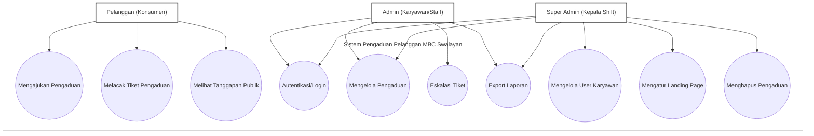
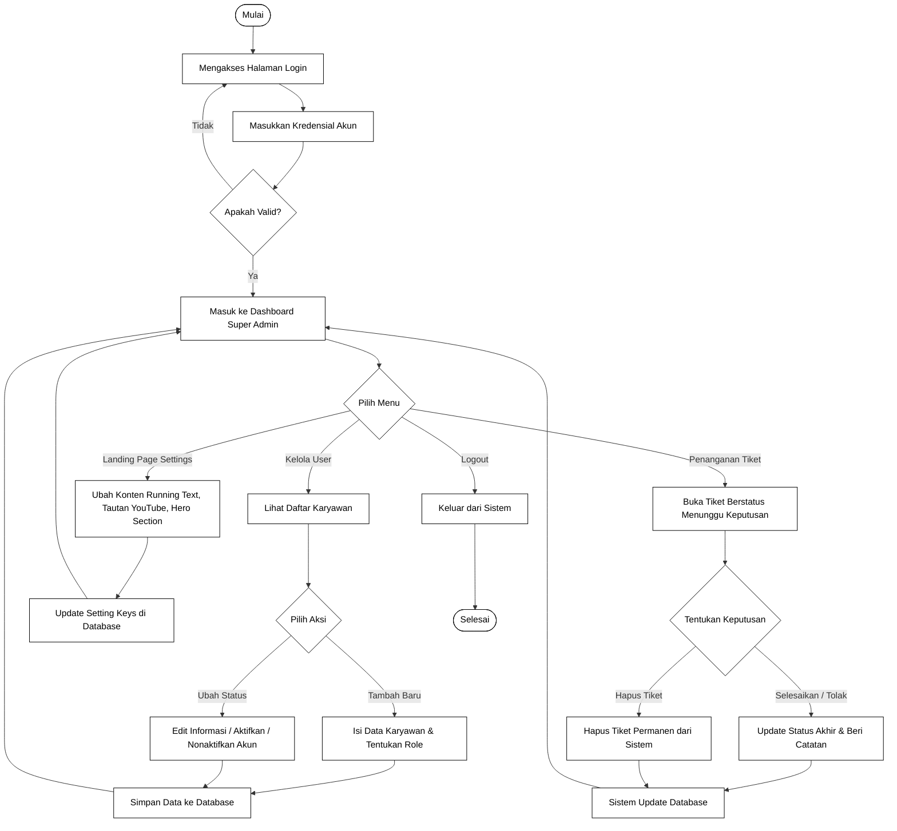
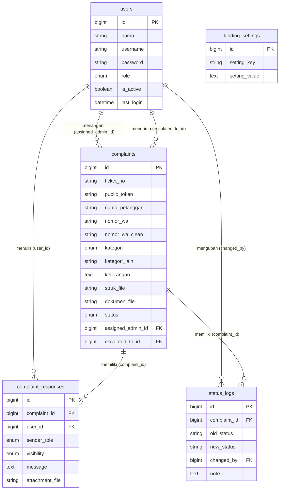

# Dokumentasi Perancangan Sistem Pengaduan Pelanggan (Sipena) MBC Swalayan

Berikut adalah perancangan sistem yang diusulkan oleh penulis sebagai acuan sebelum proses pembuatan kode program dilakukan.

---

## 2. Desain Sistem
Pada tahap ini, penulis menerjemahkan sistem yang dapat menentukan proses dan data yang diperlukan pada sistem pengaduan yang sudah dirancang sebelum pembuatan koding.

### 1) Use Case Diagram
Use Case Diagram menggambarkan fungsionalitas sistem dari sudut pandang interaksi antara pengguna atau aktor dengan sistem pengaduan pelanggan yang dinamakan Sipena pada MBC Swalayan. Diagram use case tersebut adalah sebagai berikut:



*Gambar 2.1. Use Case Diagram Sistem Informasi Pengaduan Pelanggan (Sipena) Pada MBC Swalayan.*

---

### 2) Activity Diagram
Activity diagram menunjukkan aliran kerja dari use case diagram untuk masing-masing role pengguna.

#### (1) Activity Diagram Admin
Pada Gambar 2.2 berikut merupakan activity diagram admin dalam mengelola data pada sistem informasi pengaduan pelanggan MBC Swalayan mulai dari proses autentikasi login hingga melakukan aksi pengelolaan.


*Gambar 2.2. Activity Diagram Admin Sistem Informasi Pengaduan Pelanggan (Sipena).*

---

#### (2) Activity Diagram Konsumen (Pelanggan)
Pada Gambar 2.3 berikut merupakan activity diagram pada konsumen dalam menerima informasi, melacak status pengaduan, dan mengirimkan keluhan pada sistem informasi pengaduan pelanggan MBC Swalayan.


*Gambar 2.3. Activity Diagram Konsumen Sistem Informasi Pengaduan Pelanggan (Sipena).*

---

#### (3) Activity Diagram Super Admin
Pada Gambar 2.4 berikut merupakan activity diagram Super Admin dalam melakukan pengelolaan data karyawan, konfigurasi landing page, serta menangani keluhan tingkat lanjut yang membutuhkan eskalasi di dalam sistem pengaduan pelanggan.


*Gambar 2.4. Activity Diagram Super Admin Sistem Informasi Pengaduan Pelanggan (Sipena).*

---

## 3. Desain Prosedur Sistem Yang Diusulkan
Proses desain akan menerjemahkan sebuah perancangan perangkat lunak yang di mana sebelumnya diperkirakan untuk diimplementasikan ke koding. Berikut adalah langkah untuk melakukan desain sistem: desain database dan desain interface.

### a. Desain Database
Desain database terbagi menjadi dua bagian, yaitu Entity Relationship Diagram sistem informasi pengaduan pelanggan pada MBC Swalayan serta tabel.

#### 1. Entity Relationship Diagram sistem informasi pengaduan pelanggan pada MBC Swalayan
Berdasarkan Gambar 3.1, Entity Relationship Diagram sistem informasi pengaduan pelanggan pada MBC Swalayan terbagi menjadi lima tabel, yaitu tabel users, complaints, complaint_responses, status_logs, serta landing_settings, di mana setiap entitas memiliki beberapa atribut.


*Gambar 3.1. Entity Relationship Diagram (ERD) Sipena MBC Swalayan.*

---

#### 2) Tabel
Tabel database atau basis data adalah kumpulan file yang berkaitan dengan program, yang di mana untuk menyimpan data sistem informasi pengaduan pelanggan pada MBC Swalayan dibutuhkan database. Berikut ini adalah tabel – tabel yang berada dalam database:

##### (1) Tabel `users`
Tabel `users` diperlukan untuk mendaftarkan akun administrator sistem dan berfungsi untuk memproses otentikasi login serta identifikasi hak akses level pengguna, baik Admin maupun Super Admin.

Nama Tabel	: users
Attribute   	: id, nama, username, password, role, is_active, last_login, created_at, updated_at
Primary key 	: id
Jumlah field	: 9

| Field | Type | Null | Key | Default | Extra |
| :--- | :--- | :--- | :--- | :--- | :--- |
| `id` | bigint unsigned | NO | PRI | NULL | auto_increment |
| `nama` | varchar(255) | NO | | NULL | |
| `username` | varchar(255) | NO | UNI | NULL | |
| `password` | varchar(255) | NO | | NULL | |
| `role` | enum('admin','super_admin') | NO | | 'admin' | |
| `is_active` | tinyint(1) | NO | | 1 | |
| `last_login` | datetime | YES | | NULL | |
| `created_at` | timestamp | YES | | NULL | |
| `updated_at` | timestamp | YES | | NULL | |

##### (2) Tabel `complaints`
Tabel `complaints` diperlukan untuk merekam seluruh rincian keluhan masuk yang diajukan oleh konsumen.

Nama Tabel	: complaints
Attribute   	: id, ticket_no, public_token, nama_pelanggan, nomor_wa, nomor_wa_clean, kategori, kategori_lain, keterangan, struk_file, dokumen_file, status, assigned_admin_id, escalated_to_id, created_at, updated_at, closed_at
Primary key 	: id
Jumlah field	: 17

| Field | Type | Null | Key | Default | Extra |
| :--- | :--- | :--- | :--- | :--- | :--- |
| `id` | bigint unsigned | NO | PRI | NULL | auto_increment |
| `ticket_no` | varchar(30) | NO | UNI | NULL | |
| `public_token` | varchar(100) | NO | UNI | NULL | |
| `nama_pelanggan` | varchar(100) | NO | | NULL | |
| `nomor_wa` | varchar(30) | NO | | NULL | |
| `nomor_wa_clean` | varchar(30) | NO | | NULL | |
| `kategori` | enum('pelayanan','return_produk','produk','masalah_lain') | NO | | NULL | |
| `kategori_lain` | varchar(150) | YES | | NULL | |
| `keterangan` | text | YES | | NULL | |
| `struk_file` | varchar(255) | YES | | NULL | |
| `dokumen_file` | varchar(255) | YES | | NULL | |
| `status` | enum('diajukan','diproses','diteruskan','menunggu_keputusan','ditanggapi','selesai','ditolak') | NO | | 'diajukan' | |
| `assigned_admin_id` | bigint unsigned | YES | MUL | NULL | |
| `escalated_to_id` | bigint unsigned | YES | MUL | NULL | |
| `created_at` | timestamp | YES | | NULL | |
| `updated_at` | timestamp | YES | | NULL | |
| `closed_at` | datetime | YES | | NULL | |

##### (3) Tabel `complaint_responses`
Tabel `complaint_responses` diperlukan untuk mendata percakapan dan respon balasan dari staff admin maupun sistem.

Nama Tabel	: complaint_responses
Attribute   	: id, complaint_id, user_id, sender_role, visibility, message, attachment_file, created_at, updated_at
Primary key 	: id
Jumlah field	: 9

| Field | Type | Null | Key | Default | Extra |
| :--- | :--- | :--- | :--- | :--- | :--- |
| `id` | bigint unsigned | NO | PRI | NULL | auto_increment |
| `complaint_id` | bigint unsigned | NO | MUL | NULL | |
| `user_id` | bigint unsigned | YES | MUL | NULL | |
| `sender_role` | enum('admin','super_admin','system') | NO | | 'admin' | |
| `visibility` | enum('internal','public') | NO | | 'internal' | |
| `message` | text | NO | | NULL | |
| `attachment_file` | varchar(255) | YES | | NULL | |
| `created_at` | timestamp | YES | | NULL | |
| `updated_at` | timestamp | YES | | NULL | |

##### (4) Tabel `status_logs`
Tabel `status_logs` diperlukan untuk mencatat riwayat perubahan status pelaporan keluhan secara berurutan.

Nama Tabel	: status_logs
Attribute   	: id, complaint_id, old_status, new_status, changed_by, note, created_at, updated_at
Primary key 	: id
Jumlah field	: 8

| Field | Type | Null | Key | Default | Extra |
| :--- | :--- | :--- | :--- | :--- | :--- |
| `id` | bigint unsigned | NO | PRI | NULL | auto_increment |
| `complaint_id` | bigint unsigned | NO | MUL | NULL | |
| `old_status` | varchar(50) | YES | | NULL | |
| `new_status` | varchar(50) | NO | | NULL | |
| `changed_by` | bigint unsigned | YES | MUL | NULL | |
| `note` | text | YES | | NULL | |
| `created_at` | timestamp | YES | | NULL | |
| `updated_at` | timestamp | YES | | NULL | |

##### (5) Tabel `landing_settings`
Tabel `landing_settings` diperlukan untuk menampung pengaturan data antarmuka halaman beranda secara dinamis.

Nama Tabel	: landing_settings
Attribute   	: id, setting_key, setting_value, created_at, updated_at
Primary key 	: id
Jumlah field	: 5

| Field | Type | Null | Key | Default | Extra |
| :--- | :--- | :--- | :--- | :--- | :--- |
| `id` | bigint unsigned | NO | PRI | NULL | auto_increment |
| `setting_key` | varchar(100) | NO | UNI | NULL | |
| `setting_value` | text | YES | | NULL | |
| `created_at` | timestamp | YES | | NULL | |
| `updated_at` | timestamp | YES | | NULL | |

---

#### 3) Relasi Tabel
Berdasarkan Gambar 3.2 relasi tabel ini memiliki 5 tabel, yaitu tabel `users`, `complaints`, `complaint_responses`, `status_logs`, dan `landing_settings`. Berikut relasi tabel:


*Gambar 3.2. Relasi Tabel Database Sipena MBC Swalayan.*

---

### b. Desain Interface

#### 1) Rancangan Form Login Admin
Tampilan form login digunakan untuk memberikan hak akses kepada administrator, yaitu Admin atau Super Admin, untuk masuk ke halaman dashboard internal sistem. Form tersebut dirancang sebagai berikut:

##### Halaman Form Login Admin
```
+-------------------------------------------------------------------+
|                            LOGIN ADMIN                            |
+-------------------------------------------------------------------+
|                                                                   |
|   Username : [_________________________________________________]  |
|                                                                   |
|   Password : [_________________________________________________]  |
|                                                                   |
|                       [ MASUK ]                                   |
|                                                                   |
+-------------------------------------------------------------------+
```
*Gambar 3.3. Rancangan Form Login Admin.*

##### Tabel 3.1. Rancangan Tombol Form Login Admin
| No | Tombol | Fungsi |
| :--- | :--- | :--- |
| 1 | `MASUK` | Berfungsi untuk mengirimkan kredensial berupa username dan password ke sistem untuk divalidasi. Jika sukses, admin dialihkan ke halaman dashboard. |

---

#### 2) Rancangan Form Pengaduan (Konsumen)
Tampilan halaman pengaduan adalah halaman formulir publik ketika konsumen mengakses website sistem pengaduan untuk menulis keluhan. Rancangan ini adalah sebagai berikut:

##### Halaman Form Pengaduan Konsumen
```
+-------------------------------------------------------------------+
|                   FORMULIR PENGADUAN PELANGGAN                    |
+-------------------------------------------------------------------+
|                                                                   |
|  Nama Pelanggan : [____________________________________________]  |
|                                                                   |
|  Nomor WhatsApp : [____________________________________________]  |
|                                                                   |
|  Kategori       : [ Pelayanan / Produk / Return / Masalah Lain v] |
|                                                                   |
|  Struk Belanja  : [ Pilih File ] (Wajib jika kategori return)     |
|                                                                   |
|  Dokumen Bukti  : [ Pilih File ] (Opsional)                       |
|                                                                   |
|  Keterangan     :                                                 |
|  +-------------------------------------------------------------+  |
|  | Tulis isi keluhan Anda di sini...                           |  |
|  +-------------------------------------------------------------+  |
|                                                                   |
|                       [ KIRIM ADUAN ]                             |
|                                                                   |
+-------------------------------------------------------------------+
```
*Gambar 3.4. Rancangan Form Pengaduan Konsumen.*

##### Tabel 3.2. Rancangan Tombol Form Pengaduan Konsumen
| No | Tombol | Fungsi |
| :--- | :--- | :--- |
| 1 | `Pilih File` | Membuka galeri/penyimpanan perangkat untuk memilih dokumen struk belanja atau dokumen bukti. |
| 2 | `KIRIM ADUAN`| Mengirimkan data formulir keluhan pelanggan ke database dan membuat nomor tiket otomatis. |

---

#### 3) Rancangan Halaman Tracking (Konsumen)
Tampilan halaman tracking digunakan oleh konsumen untuk melacak status aduan dengan nomor tiket mereka. Rancangan ini adalah sebagai berikut:

##### Halaman Tracking Pengaduan
```
+-------------------------------------------------------------------+
|                     CEK STATUS PENGADUAN                          |
+-------------------------------------------------------------------+
|                                                                   |
|  Nomor Tiket    : [ Contoh: SPN-20260612-0001 _________________]  |
|                                                                   |
|  Nomor WhatsApp : [ Contoh: 081234567890 ______________________]  |
|                                                                   |
|                       [ LACAK STATUS ]                            |
|                                                                   |
+-------------------------------------------------------------------+
```
*Gambar 3.5. Rancangan Halaman Tracking.*

##### Tabel 3.3. Rancangan Tombol Halaman Tracking
| No | Tombol | Fungsi |
| :--- | :--- | :--- |
| 1 | `LACAK STATUS` | Melakukan pencarian tiket pengaduan di database. Jika ditemukan, menampilkan halaman riwayat detail dan progress keluhan. |
