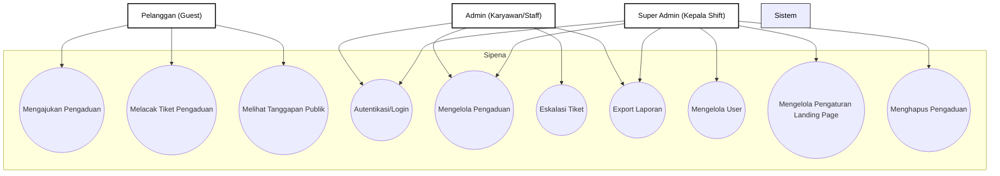
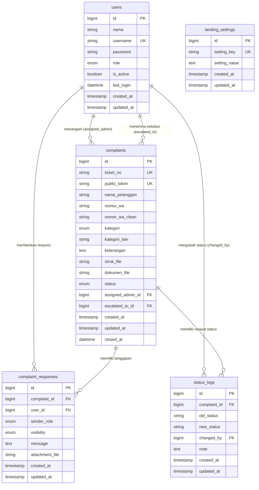

# Dokumentasi Perancangan Sistem Pengaduan Pelanggan (Sipena) - Edisi Skripsi

Bab ini membahas perancangan sistem informasi pengaduan pelanggan berbasis web (Sipena) pada MBC Swalayan yang meliputi Use Case Diagram, Activity Diagram, Desain Prosedur Sistem, Desain Database (ERD, Tabel, Relasi), serta Desain Interface.

---

## 2. Desain Sistem
Pada tahap ini, penulis menerjemahkan sistem yang dapat menentukan proses dan data yang diperlukan pada sistem pengaduan yang sudah dirancang sebelum pembuatan koding.

### 1) Use Case Diagram
Use Case Diagram menggambarkan interaksi antara aktor (pengguna sistem) dengan fungsionalitas yang disediakan oleh sistem informasi pengaduan pelanggan (Sipena) pada MBC Swalayan adalah sebagai berikut:

Gambar 3.1 Use Case Diagram Sipena


---

### 2) Activity Diagram
Activity diagram menunjukkan aliran kerja workflow dari use case diagram. Berikut adalah activity diagram sistem informasi pengaduan pelanggan (Sipena) pada MBC Swalayan:

#### (1) Activity Diagram Admin
Pada Gambar 3.2 berikut, merupakan activity diagram admin dalam mengelola data pada sistem informasi pengaduan pelanggan (Sipena) pada MBC Swalayan:

Gambar 3.2 Activity Diagram Admin
```mermaid
flowchart TD
    StartAdmin([Mulai]) --> FormLogin[Mengakses Halaman Login Admin]
    FormLogin --> InputAuth[Masukkan Username & Password]
    InputAuth --> SubmitLogin[Klik Login]
    SubmitLogin --> CekAuth{Apakah Kredensial Valid?}
    CekAuth -->|Tidak| TampilkanGagal[Tampilkan Pesan Error: Username/Password Salah]
    TampilkanGagal --> FormLogin
    CekAuth -->|Ya| Dashboard[Masuk ke Halaman Dashboard Admin]

    Dashboard --> PilihMenu{Pilih Menu Utama}

    %% Alur Kelola Pengaduan
    PilihMenu -->|Kelola Pengaduan| TampilkanList[Lihat Daftar Pengaduan Masuk]
    TampilkanList --> BukaDetail[Buka Detail Pengaduan]
    BukaDetail --> PilihanAksi{Pilih Aksi Tindakan}

    %% Sub Aksi Kelola
    PilihanAksi -->|Ubah Status| UpdateStatus[Pilih Status Baru: Diproses/Selesai/Ditolak]
    UpdateStatus --> SimpanStatus[Sistem Update Status & Tulis Log Perubahan]
    
    PilihanAksi -->|Tulis Tanggapan| InputTanggapan[Tulis Tanggapan Publik / Catatan Internal]
    InputTanggapan --> SimpanTanggapan[Sistem Menyimpan Tanggapan Baru]

    PilihanAksi -->|Eskalasi| Eskalasi[Klik Eskalasi ke Kepala Shift]
    Eskalasi --> InputCatatan[Tulis Catatan Eskalasi]
    InputCatatan --> SimpanEskalasi[Status berubah menjadi Menunggu Keputusan]

    SimpanStatus --> SelesaiAksi[Kembali ke Halaman Detail / Dashboard]
    SimpanTanggapan --> SelesaiAksi
    SimpanEskalasi --> SelesaiAksi

    %% Alur Export Laporan
    PilihMenu -->|Export Laporan| FilterLaporan[Filter Berdasarkan Kategori/Status/Bulan/Tahun]
    FilterLaporan --> CetakData[Unduh file CSV / Word / Cetak PDF]
    CetakData --> Dashboard

    PilihMenu -->|Logout| KeluarSistem[Logout dari Dashboard]
    KeluarSistem --> EndAdmin([Selesai])
    SelesaiAksi --> PilihMenu

    %% Style (B&W)
    classDef default fill:#fff,stroke:#000,stroke-width:1px,color:#000;
    linkStyle default stroke:#000,stroke-width:1px,color:#000;
```

#### (2) Activity Diagram Konsumen (Pelanggan)
Pada Gambar 3.3 berikut merupakan activity diagram pada konsumen/pelanggan dalam menerima informasi, mengajukan keluhan, serta melacak status pengaduan pada sistem informasi pengaduan pelanggan (Sipena) pada MBC Swalayan:

Gambar 3.3 Activity Diagram Konsumen/Pelanggan
```mermaid
flowchart TD
    StartPelanggan([Mulai]) --> MasukWeb[Mengakses Website Sipena]
    MasukWeb --> PilihMenu{Pilih Aktivitas}

    %% Alur Kirim Pengaduan
    PilihMenu -->|Kirim Pengaduan| IsiForm[Mengisi Form Pengaduan]
    IsiForm --> UploadFile[Unggah File Pendukung / Struk Belanja jika Return]
    UploadFile --> Kirim[Klik Tombol Kirim Pengaduan]
    Kirim --> ValidasiInput{Apakah Input Valid?}
    ValidasiInput -->|Tidak| TampilkanError[Tampilkan Pesan Error / Validasi Form]
    TampilkanError --> IsiForm
    ValidasiInput -->|Ya| SimpanDb[Sistem Menyimpan Pengaduan ke Database]
    SimpanDb --> GenerateTiket[Sistem Membuat Nomor Tiket & Token Unik]
    GenerateTiket --> TampilkanTiket[Tampilkan Halaman Sukses & Nomor Tiket]
    TampilkanTiket --> EndPelanggan

    %% Alur Tracking Pengaduan
    PilihMenu -->|Lacak Pengaduan| InputLacak[Masukkan Nomor Tiket & Nomor WhatsApp]
    InputLacak --> CariData[Sistem Mencari Data Tiket]
    CariData --> CekData{Apakah Data Ditemukan?}
    CekData -->|Tidak| MsgError[Tampilkan Pesan: Tiket Tidak Ditemukan]
    MsgError --> InputLacak
    CekData -->|Ya| TampilkanStatus[Tampilkan Status Pengaduan & Log Tanggapan]
    TampilkanStatus --> EndPelanggan([Selesai])

    %% Style (B&W)
    classDef default fill:#fff,stroke:#000,stroke-width:1px,color:#000;
    linkStyle default stroke:#000,stroke-width:1px,color:#000;
```

---

## 3. Desain Prosedur Sistem Yang Diusulkan
Proses desain akan menerjemahkan sebuah perancangan perangkat lunak yang dimana sebelumnya diperkirakan untuk diimplementasikan ke koding. Berikut adalah langkah untuk melakukan desain sistem: desain database dan desain interface.

### a. Desain Database
Desain database terbagi menjadi 2 yaitu ERD (Entity Relationship Diagram) sistem informasi pengaduan pelanggan (Sipena) pada MBC Swalayan dan tabel.

#### 1) ERD (Entity Relationship Diagram) sistem informasi pengaduan pelanggan (Sipena) pada MBC Swalayan
Berdasarkan Gambar 3.5. ERD (Entity Relationship Diagram) sistem informasi pengaduan pelanggan (Sipena) pada MBC Swalayan terbagi menjadi 5 tabel (users, complaints, complaint_responses, status_logs, dan landing_settings) dimana pada setiap entitas memiliki beberapa atribut.

Gambar 3.5 ERD Notasi Chen Sipena
```mermaid
flowchart TD
    %% ENTITIES (Persegi Panjang)
    U[users]
    C[complaints]
    CR[complaint_responses]
    SL[status_logs]
    LS[landing_settings]

    %% RELATIONSHIPS (Belah Ketupat)
    R1{menangani}
    R2{menerima}
    R3{menulis}
    R4{mengubah}
    R5{memiliki}
    R6{memiliki}

    %% ATTRIBUTES (Bulat Lonjong)
    
    %% Users Attributes
    u_id(["<u>id</u>"])
    u_nama(["nama"])
    u_username(["username"])
    u_password(["password"])
    u_role(["role"])
    u_is_active(["is_active"])
    u_last_login(["last_login"])

    U --- u_id
    U --- u_nama
    U --- u_username
    U --- u_password
    U --- u_role
    U --- u_is_active
    U --- u_last_login

    %% Complaints Attributes
    c_id(["<u>id</u>"])
    c_ticket(["ticket_no"])
    c_token(["public_token"])
    c_pelanggan(["nama_pelanggan"])
    c_wa(["nomor_wa"])
    c_kat(["kategori"])
    c_kat_lain(["kategori_lain"])
    c_ket(["keterangan"])
    c_struk(["struk_file"])
    c_dok(["dokumen_file"])
    c_status(["status"])
    c_closed(["closed_at"])

    C --- c_id
    C --- c_ticket
    C --- c_token
    C --- c_pelanggan
    C --- c_wa
    C --- c_kat
    C --- c_kat_lain
    C --- c_ket
    C --- c_struk
    C --- c_dok
    C --- c_status
    C --- c_closed

    %% Complaint Responses Attributes
    cr_id(["<u>id</u>"])
    cr_sender(["sender_role"])
    cr_vis(["visibility"])
    cr_msg(["message"])
    cr_att(["attachment_file"])

    CR --- cr_id
    CR --- cr_sender
    CR --- cr_vis
    CR --- cr_msg
    CR --- cr_att

    %% Status Logs Attributes
    sl_id(["<u>id</u>"])
    sl_old(["old_status"])
    sl_new(["new_status"])
    sl_note(["note"])

    SL --- sl_id
    SL --- sl_old
    SL --- sl_new
    SL --- sl_note

    %% Landing Settings Attributes
    ls_id(["<u>id</u>"])
    ls_key(["setting_key"])
    ls_val(["setting_value"])

    LS --- ls_id
    LS --- ls_key
    LS --- ls_val

    %% RELATIONSHIP CONNECTIONS (Sesuai Struktur Relasi di Database)
    
    %% Users - menangani - Complaints (1 to N)
    U ---|1| R1
    R1 -->|N| C
    
    %% Users - menerima - Complaints (1 to N, eskalasi)
    U ---|1| R2
    R2 -->|N| C
    
    %% Users - menulis - Responses (1 to N)
    U ---|1| R3
    R3 -->|N| CR
    
    %% Users - mengubah - Logs (1 to N)
    U ---|1| R4
    R4 -->|N| SL
    
    %% Complaints - memiliki - Responses (1 to N)
    C ---|1| R5
    R5 -->|N| CR
    
    %% Complaints - memiliki - Logs (1 to N)
    C ---|1| R6
    R6 -->|N| SL

    %% STYLING (Monokromatik: Lingkaran/Bentuk Putih, Font & Line Hitam)
    classDef default fill:#fff,stroke:#000,stroke-width:1px,color:#000;
    classDef entity fill:#fff,stroke:#000,stroke-width:2px,color:#000;
    classDef relationship fill:#fff,stroke:#000,stroke-width:2px,color:#000;

    class U,C,CR,SL,LS entity;
    class R1,R2,R3,R4,R5,R6 relationship;
    linkStyle default stroke:#000,stroke-width:1.5px,color:#000;
```

---

#### 2) Tabel
Tabel database atau basis data adalah kumpulan file yang berkaitan dengan program, yang dimana untuk menyimpan data sistem informasi pengaduan pelanggan (Sipena) Pada MBC Swalayan dibutuhkan database. Berikut ini adalah tabel – tabel yang berada dalam database :

##### (1) Tabel users
Tabel users diperlukan untuk menyimpan data akun karyawan atau pengguna sistem dan berfungsi untuk proses autentikasi (login) serta pengaturan hak akses dashboard. Dibawah ini adalah struktur tabel users:

| Nama Kolom | Tipe Data | Atribut | Deskripsi |
| :--- | :--- | :--- | :--- |
| `id` | bigint | Primary Key, Auto Increment | ID unik pengguna |
| `nama` | string(255) | Not Null | Nama lengkap pengguna |
| `username` | string(255) | Unique, Not Null | Nama pengguna untuk login |
| `password` | string(255) | Not Null | Kata sandi yang telah di-hash (Bcrypt) |
| `role` | enum('admin', 'super_admin') | Not Null, Default: 'admin' | Hak akses level pengguna |
| `is_active` | boolean | Default: true | Status keaktifan akun pengguna |
| `last_login` | datetime | Nullable | Catatan waktu login terakhir |
| `created_at` | timestamp | Nullable | Waktu pembuatan baris data |
| `updated_at` | timestamp | Nullable | Waktu perubahan terakhir data |

##### (2) Tabel complaints
Tabel complaints diperlukan untuk menyimpan data seluruh keluhan atau pengaduan yang diajukan oleh konsumen dan berfungsi sebagai tabel inti penyimpanan data laporan keluhan. Dibawah ini adalah struktur tabel complaints:

| Nama Kolom | Tipe Data | Atribut | Deskripsi |
| :--- | :--- | :--- | :--- |
| `id` | bigint | Primary Key, Auto Increment | ID unik pengaduan |
| `ticket_no` | string(30) | Unique, Index, Not Null | Nomor tiket keluhan (Format: SPN-YYYYMMDD-XXXX) |
| `public_token` | string(100) | Unique, Not Null | Token rahasia untuk melacak pengaduan publik |
| `nama_pelanggan`| string(100) | Not Null | Nama lengkap pelapor |
| `nomor_wa` | string(30) | Not Null | Nomor WhatsApp pelapor |
| `nomor_wa_clean`| string(30) | Index, Not Null | Nomor WhatsApp pelapor (hanya angka) untuk pencarian |
| `kategori` | enum(...) | Index, Not Null | Kategori keluhan: 'pelayanan', 'return_produk', 'produk', 'masalah_lain' |
| `kategori_lain` | string(150) | Nullable | Spesifikasi keluhan jika memilih kategori 'masalah_lain' |
| `keterangan` | text | Nullable | Uraian lengkap mengenai kronologi keluhan |
| `struk_file` | string(255) | Nullable | Path lokasi file unggah struk belanja (wajib untuk return_produk) |
| `dokumen_file` | string(255) | Nullable | Path lokasi file unggah dokumen bukti pendukung lainnya |
| `status` | enum(...) | Index, Not Null, Default: 'diajukan' | Status pengaduan: 'diajukan', 'diproses', 'diteruskan', 'menunggu_keputusan', 'ditanggapi', 'selesai', 'ditolak' |
| `assigned_admin_id` | bigint | Foreign Key (users), Nullable | ID Admin yang ditugaskan menangani pengaduan |
| `escalated_to_id` | bigint | Foreign Key (users), Nullable | ID Super Admin tempat tiket ini dieskalasikan |
| `created_at` | timestamp | Index, Nullable | Tanggal pengaduan diajukan oleh pelanggan |
| `updated_at` | timestamp | Nullable | Tanggal perubahan data pengaduan |
| `closed_at` | datetime | Nullable | Tanggal keluhan dinyatakan selesai/ditutup |

##### (3) Tabel complaint_responses
Tabel complaint_responses diperlukan untuk menyimpan data percakapan/tanggapan dari keluhan dan berfungsi untuk pencatatan respons dari admin maupun internal catatan staff. Dibawah ini adalah struktur tabel complaint_responses:

| Nama Kolom | Tipe Data | Atribut | Deskripsi |
| :--- | :--- | :--- | :--- |
| `id` | bigint | Primary Key, Auto Increment | ID unik tanggapan |
| `complaint_id` | bigint | Foreign Key (complaints), Not Null | ID pengaduan yang ditanggapi |
| `user_id` | bigint | Foreign Key (users), Nullable | ID pengguna (staff) yang membalas |
| `sender_role` | enum('admin','super_admin','system') | Default: 'admin' | Peran dari pengirim tanggapan |
| `visibility` | enum('internal','public') | Index, Default: 'internal' | Visibilitas tanggapan: 'internal' atau 'public' |
| `message` | text | Not Null | Isi teks tanggapan |
| `attachment_file` | string(255) | Nullable | Path lokasi file dokumen lampiran pendukung tanggapan |
| `created_at` | timestamp | Index, Nullable | Tanggal tanggapan dikirimkan |
| `updated_at` | timestamp | Nullable | Tanggal perubahan tanggapan |

##### (4) Tabel status_logs
Tabel status_logs diperlukan untuk mencatat riwayat perubahan status keluhan dan berfungsi sebagai jejak audit (audit trail) penanganan tiket. Dibawah ini adalah struktur tabel status_logs:

| Nama Kolom | Tipe Data | Atribut | Deskripsi |
| :--- | :--- | :--- | :--- |
| `id` | bigint | Primary Key, Auto Increment | ID unik log status |
| `complaint_id` | bigint | Foreign Key (complaints), Not Null | ID pengaduan yang mengalami perubahan status |
| `old_status` | string(50) | Nullable | Status sebelum diubah |
| `new_status` | string(50) | Not Null | Status baru setelah diubah |
| `changed_by` | bigint | Foreign Key (users), Nullable | ID pengguna (staff) yang melakukan perubahan status |
| `note` | text | Nullable | Alasan atau catatan tambahan terkait perubahan status |
| `created_at` | timestamp | Index, Nullable | Tanggal log status dicatat |
| `updated_at` | timestamp | Nullable | Tanggal log status diperbarui |

##### (5) Tabel landing_settings
Tabel landing_settings diperlukan untuk menyimpan konten dinamis halaman depan (landing page) dan berfungsi untuk kustomisasi tampilan teks dan video oleh Super Admin. Dibawah ini adalah struktur tabel landing_settings:

| Nama Kolom | Tipe Data | Atribut | Deskripsi |
| :--- | :--- | :--- | :--- |
| `id` | bigint | Primary Key, Auto Increment | ID unik pengaturan |
| `setting_key` | string(100) | Unique, Not Null | Kata kunci pengaturan (contoh: `running_text`, `youtube_url`) |
| `setting_value`| text | Nullable | Nilai teks atau konten dari pengaturan |
| `created_at` | timestamp | Nullable | Tanggal konfigurasi dibuat |
| `updated_at` | timestamp | Nullable | Tanggal konfigurasi diperbarui |

---

#### 3) Relasi Tabel
Berdasarkan Gambar 3.6 relasi tabel ini memiliki 5 tabel, yaitu tabel users, complaints, complaint_responses, status_logs, dan landing_settings. Dibawah ini adalah Gambar 3.6. Berikut relasi tabel:

Gambar 3.6 Skema Relasi Database (Physical Data Model)


Penjelasan Relasi Database:
- **Relasi Antara `users` dengan `complaints`**: Satu admin (`users`) dapat menangani nol hingga banyak tiket pengaduan (`complaints`). Namun, setiap pengaduan hanya dapat dialokasikan penanganannya kepada maksimal satu admin.
- **Relasi Eskalasi Antara `users` dengan `complaints`**: Satu Kepala Shift (`users` dengan level `super_admin`) dapat menerima eskalasi dari banyak pengaduan. Namun, satu keluhan hanya dapat dieskalasikan statusnya kepada maksimal satu Kepala Shift.
- **Relasi Antara `complaints` dengan `complaint_responses`**: Satu tiket pengaduan pelanggan dapat memiliki banyak tanggapan pesan, sedangkan setiap pesan tanggapan hanya dapat merujuk ke satu tiket pengaduan yang bersangkutan.
- **Relasi Antara `users` dengan `complaint_responses`**: Satu user sistem dapat menulis banyak pesan tanggapan pengaduan, sedangkan setiap pesan tanggapan hanya dapat diidentifikasi kepemilikan penulisnya oleh satu user sistem saja.
- **Relasi Antara `complaints` dengan `status_logs`**: Satu pengaduan dapat menghasilkan banyak log riwayat perubahan status seiring berjalannya proses penanganan, sedangkan setiap log riwayat status hanya mendokumentasikan perubahan pada satu pengaduan saja.
- **Relasi Antara `users` dengan `status_logs`**: Satu admin dapat memicu pencatatan banyak log perubahan status akibat tindakannya memperbarui tiket pengaduan, sedangkan setiap baris log perubahan status hanya mencatat satu admin yang melakukan tindakan perubahan tersebut.

---

### b. Desain Interface
Desain interface menjabarkan rancangan antarmuka visual halaman sistem pengaduan pelanggan (Sipena) pada MBC Swalayan baik dari sisi pelanggan maupun sisi administratif.

#### 1) Rancangan Form Login
Tampilan form login digunakan untuk memverifikasi akun Admin dan Super Admin sebelum masuk ke dashboard pengelolaan data. Berikut adalah Gambar 3.7. Form Login:

Gambar 3.7 Rancangan Form Login
```
+-----------------------------------------------------------+
|                      LOGIN ADMIN                          |
+-----------------------------------------------------------+
|                                                           |
|  Username: [__________________________________________ ]  |
|  Password: [__________________________________________ ]  |
|                                                           |
|               [           MASUK           ]               |
+-----------------------------------------------------------+
```

#### 2) Rancangan Form Pengaduan
Tampilan form pengaduan digunakan oleh pelanggan/konsumen untuk mengisi data pengaduan online. Berikut adalah Gambar 3.8. Form Pengaduan:

Gambar 3.8 Rancangan Form Pengaduan
```
+-----------------------------------------------------------+
|                   FORM PENGADUAN BARU                     |
+-----------------------------------------------------------+
|  Nama Pelanggan: [_____________________________________]  |
|  Nomor WhatsApp: [_____________________________________]  |
|  Pilihan Masalah: [Pelayanan / Produk / Return / Lain  v] |
|  Upload Struk Belanja: [ Choose File  ] (untuk return)    |
|  Upload Dokumen Bukti: [ Choose File  ] (opsional)        |
|  Keterangan Masalah:                                      |
|  [                                                     ]  |
|  [                                                     ]  |
|                                                           |
|               [       KIRIM PENGADUAN      ]              |
+-----------------------------------------------------------+
```

#### 3) Rancangan Halaman Beranda (Landing Page)
Tampilan halaman beranda adalah halaman utama ketika mengakses website sistem pengaduan pelanggan (Sipena). Halaman ini menampilkan video informasi, running text, jam operasional, dan tracking tiket. Berikut adalah Gambar 3.9. Halaman Beranda:

Gambar 3.9 Rancangan Halaman Beranda
```
+-----------------------------------------------------------+
|  [Running Text: Selamat datang di Sipena MBC Swalayan...] |
+-----------------------------------------------------------+
|  Sipena MBC Swalayan                   [Form] [Tracking]  |
+-----------------------------------------------------------+
|                                                           |
|  SISTEM PENGADUAN ONLINE          +--------------------+  |
|  Sampaikan pengaduan Anda         |                    |  |
|  secara daring dan pantau         |   Video YouTube    |  |
|  statusnya via nomor tiket.       |                    |  |
|                                   +--------------------+  |
|  [ Buat Pengaduan ]               Jam layanan:         |  |
|                                   08.00 - 21.00 WIB    |  |
|                                                           |
+-----------------------------------------------------------+
|  Lacak Pengaduan (Tracking Tiket)                         |
|  Nomor Tiket: [___________]  Nomor WA: [___________]      |
|  [ Cek Status ]                                           |
+-----------------------------------------------------------+
```

#### 4) Rancangan Halaman Dashboard Admin
Tampilan halaman dashboard admin adalah halaman setelah admin berhasil login ke dalam sistem pengaduan. Halaman ini digunakan oleh admin untuk mengelola pengaduan masuk, memperbarui status, memberi tanggapan, dan melakukan ekspor laporan. Berikut adalah Gambar 3.10. Halaman Dashboard Admin:

Gambar 3.10 Rancangan Halaman Dashboard Admin
```
+-----------------------------------------------------------+
|  Dashboard Admin                  [Pengaduan] [Laporan]   |
+-----------------------------------------------------------+
|  Selamat Datang, Admin                                    |
|  Total Pengaduan: 120 | Diproses: 15 | Selesai: 95        |
+-----------------------------------------------------------+
|  Daftar Pengaduan Terbaru                                 |
|  +--------------+-------------------+-------------+-----+  |
|  | No. Tiket    | Nama Pelanggan    | Status      |Aksi |  |
|  +--------------+-------------------+-------------+-----+  |
|  | SPN-001      | Budi              | Diajukan    |[Lihat] |  |
|  | SPN-002      | Ani               | Diproses    |[Lihat] |  |
|  +--------------+-------------------+-------------+-----+  |
+-----------------------------------------------------------+
```
